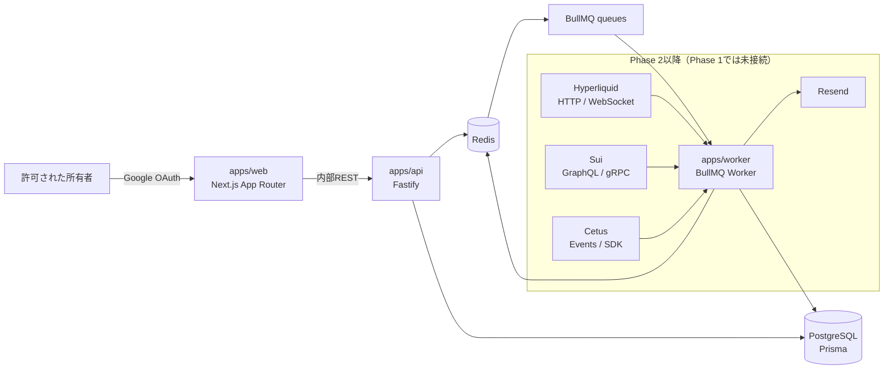
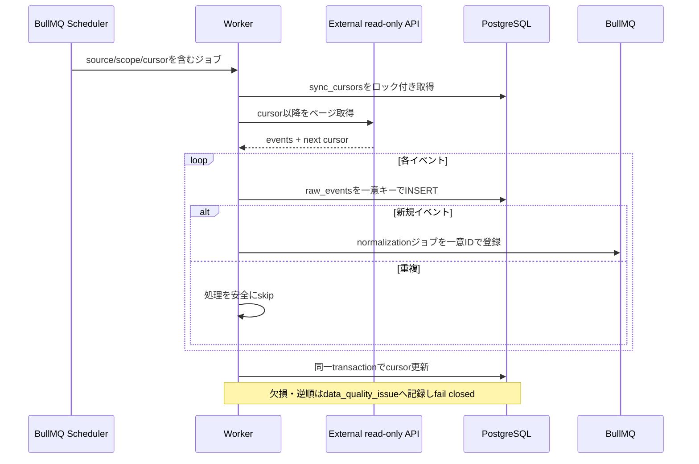
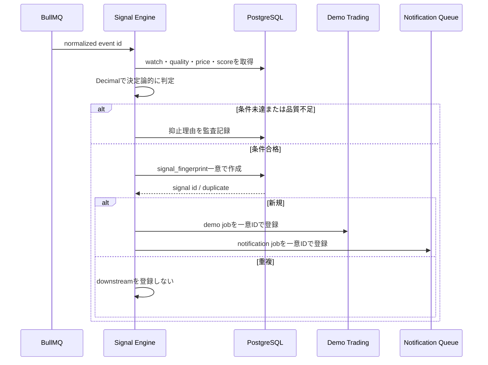
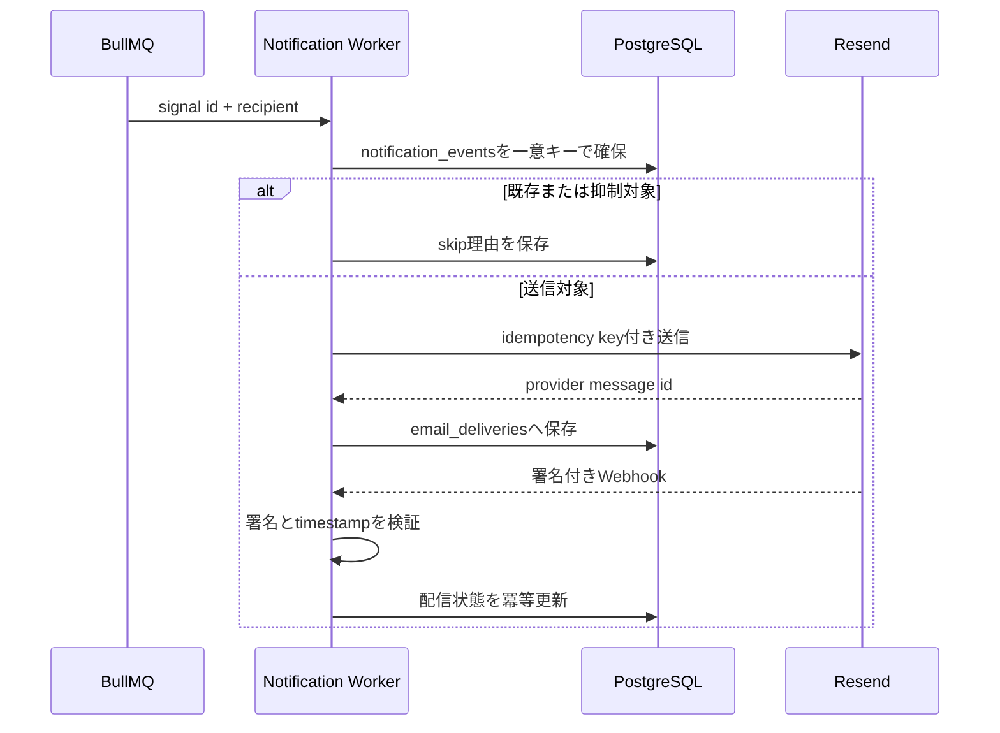

# アーキテクチャ

最終更新: 2026-07-25

## 1. 方針

- Web、API、常駐Workerを別プロセスにし、Webのライフサイクルからデータ取得を分離する。
- PostgreSQLを唯一の永続的な正本とする。
- RedisはBullMQ、短期ロック、短期キャッシュだけに使用する。
- 外部イベントはRaw保存後に正規化し、一意制約とfingerprintで冪等性を保証する。
- 金融計算は `packages/analytics` と `packages/demo-trading` の決定論的ロジックへ閉じ込める。
- LLMは計算済み結果の文章化だけに使用し、停止しても主要パイプラインが動く設計とする。

## 2. システム構成図

## 3. ランタイム責務

| コンポーネント                 | 責務                                                    | 持たせない責務             |
| ------------------------------ | ------------------------------------------------------- | -------------------------- |
| `apps/web`                     | OAuth、認証済みUI、Server Components、表示用API呼び出し | 常時監視、秘密鍵、金融計算 |
| `apps/api`                     | REST、認可、入力検証、ヘルスチェック、DB read/write     | 長時間ジョブ、チェーン署名 |
| `apps/worker`                  | BullMQ処理、外部データ取得、再試行、冪等処理            | ブラウザセッション         |
| `packages/database`            | Prisma singleton、DB型、接続管理                        | HTTP、UI                   |
| `packages/config`              | Zod環境変数、共通TS設定、ログ設定                       | 秘密値の固定埋め込み       |
| `packages/domain`              | ドメイン型、識別子、状態遷移                            | I/O                        |
| `packages/analytics`           | 決定論的な分析計算                                      | LLMによる数値生成          |
| `packages/blockchain-adapters` | 読み取り専用外部API adapter                             | Exchange/署名API           |
| `packages/demo-trading`        | 仮想注文・約定計算                                      | 実注文                     |
| `packages/notification`        | 通知組み立て・抑制                                      | 投資判断                   |
| `packages/ui`                  | shadcn/ui方式の共通UI                                   | 秘密情報、DBアクセス       |

## 4. Phase 1 の要求フロー

### 4.1 認証

1. 未認証ユーザーはログイン画面へ遷移する。
2. Auth.jsがGoogle OAuthを開始する。
3. Googleから受け取った検証済みメールを小文字化し、`ALLOWED_ADMIN_EMAIL` と完全一致で比較する。
4. 不一致ならセッション作成を拒否する。
5. ダッシュボードでもセッションメールを再確認する。
6. APIの管理エンドポイントはブラウザセッションとは別に内部APIシークレットで保護する。

### 4.2 ヘルスチェック

- `/health`: APIプロセスのliveness。依存サービス停止時もプロセスが生きていれば200。
- `/ready`: PostgreSQLとRedisを並列確認。いずれか失敗なら503。
- `/api/admin/health`: 内部APIシークレット必須。依存別の状態と応答時間を返す。
- Workerの `/health`: Workerプロセス、DB、Redis、キュー状態を返す。

### 4.3 サンプルジョブ

1. Worker起動時に固定の業務キーを持つサンプルジョブを登録する。
2. BullMQの `jobId` に業務キーを使い、同一ジョブの重複登録を抑止する。
3. 実行開始・完了・失敗を `sync_jobs` にupsertする。
4. ジョブはDBとRedisへpingし、結果を構造化ログへ出す。

## 5. 将来のデータ取得シーケンス

## 6. 将来のシグナル生成シーケンス

## 7. 将来のメール通知シーケンス

## 8. 障害・再試行

- 外部API、DB、Redisの一時障害は指数バックオフと上限回数を設定する。
- 非再試行エラー（schema不一致、認可失敗）は即時失敗させ、system alertを残す。
- BullMQの再配信は通常動作として扱い、業務一意キーで副作用を抑止する。
- Worker多重起動を許容し、同期カーソル更新にはDBロックを使用する。
- データ品質が不足する場合は新規シグナルと通知を停止する。

## 9. デプロイ単位

- ローカル: Docker Compose
- CI: GitHub Actions + PostgreSQL/Redis service container
- 本番候補: Web、API、Workerを個別デプロイし、管理PostgreSQL/Redisを共有
- Phase 1 では本番デプロイ先を固定しない。
