# データベース設計

最終更新: 2026-07-26

## 1. 基本原則

- PostgreSQLを永続データの正本とする。
- DBはUTC、UIはAsia/Tokyoで表示する。
- 金額、価格、数量、率は `Decimal` / PostgreSQL `numeric` を使用する。
- 外部IDとfingerprintに一意制約を置き、再処理を安全にする。
- Raw Eventは不変データとして保持し、正規化済みデータと分離する。
- Redisは同期カーソルや業務データの正本にしない。

## 2. Phase 1–2 物理モデル

Phase 1 のMigrationは認証・運用基盤だけを作る。取引データの各テーブルは、対応するPhaseでAPIの実データ型を確定してからMigrationを追加する。

- `users`, `accounts`, `sessions`, `verification_tokens`: Auth.js
- `data_sources`: 外部ソースの有効状態と直近成功/失敗
- `sync_jobs`: BullMQ業務ジョブの状態と冪等キー
- `system_alerts`: 運用上の警告
- `audit_logs`: 認証・管理操作の監査

Phase 2 migration は次を追加・確定した。

- `wallet_addresses`
- `raw_events`
- `normalized_trades`
- `funding_payments`
- `cash_flows`
- `perp_positions`, `perp_position_events`
- `portfolio_snapshots`, `spot_balance_snapshots`
- `order_history`
- `sync_cursors`
- `data_quality_issues`

金融値はすべて `numeric(38,18)` に保存し、API 境界から JavaScript `number` を経由させない。`RawEvent`、Fill、Funding、Ledger、Position Event、Order は source と external ID または fingerprint の一意制約で再配信を抑止する。

HTTP と WS の Funding は hash の有無や小数末尾表現が異なるため、wallet、timestamp、coin、amount、position size、rate を Decimal で正規化した transport 共通 ID を使う。

Phase 3 migration は次を追加した。

- `address_candidates`: 発見時刻、軽量統計、Enrichment/filter/昇格、履歴完全性
- `discovery_trades`: 市場WsTrade本体とbuyer/seller
- `candidate_trade_participations`: 候補と取引の一意な参加、maker/taker、buy/sell
- `candidate_coins`, `candidate_activity_buckets`: distinct coinとUTC day/hour
- `candidate_enrichment_attempts`: 要求期間、利用可能期間、endpoint結果、失敗
- `candidate_data_quality_issues`: 候補別品質問題
- `discovery_settings`, `discovery_stats`: 所有者設定と運用統計
- `discovery_cursors`, `discovery_data_quality_issues`: 市場全体Cursorと補完不能gap

主な一意制約は`discovery_trades(source_id, external_trade_id)`、`discovery_trades(source_id, fingerprint)`、`candidate_trade_participations(candidate_id, discovery_trade_id)`、`address_candidates(source_id, address)`、`discovery_cursors(source_id, scope, cursor_type)`である。

`SyncCursor.lastTimestamp` は inclusive cursor である。次回も同じ timestamp から取得し、重複は一意制約で除く。これにより同じ millisecond に複数イベントがあるページ境界を欠落させない。古い gap recovery が後から完了しても cursor は後退させない。

## 3. 全体ER図

```mermaid
erDiagram
    users ||--o{ accounts : owns
    users ||--o{ sessions : has
    users ||--o{ audit_logs : performs
    data_sources ||--o{ sync_jobs : schedules
    data_sources ||--o{ sync_cursors : tracks
    data_sources ||--o{ raw_events : emits
    wallet_addresses ||--o{ wallet_labels : has
    wallet_addresses ||--o{ address_candidates : evaluates
    wallet_addresses ||--o{ address_classifications : classified_as
    wallet_addresses ||--o{ address_metrics : measures
    wallet_addresses ||--o{ address_scores : scores
    wallet_addresses ||--o{ address_rankings : ranks
    wallet_addresses ||--o{ normalized_trades : trades
    wallet_addresses ||--o{ cash_flows : cashflow
    wallet_addresses ||--o{ token_balances : holds
    wallet_addresses ||--o{ portfolio_snapshots : snapshots
    wallet_addresses ||--o{ perp_positions : opens
    perp_positions ||--o{ perp_position_events : changes
    wallet_addresses ||--o{ funding_payments : pays
    wallet_addresses ||--o{ liquidations : suffers
    raw_events ||--o| normalized_trades : normalizes
    wallet_addresses ||--o{ watchlists : watched
    strategy_signals ||--o{ signal_sources : supported_by
    wallet_addresses ||--o{ signal_sources : originates
    strategy_signals ||--o{ notification_events : notifies
    strategy_signals ||--o{ demo_orders : creates
    demo_portfolios ||--o{ demo_orders : contains
    demo_orders ||--o{ demo_fills : fills
    demo_portfolios ||--o{ demo_positions : holds
    demo_portfolios ||--o{ demo_cash_ledger : records
    demo_portfolios ||--o{ demo_funding_ledger : funds
    notification_events ||--o{ email_deliveries : delivers
    users ||--o{ notification_rules : configures
    system_alerts }o--o| data_sources : concerns
```

## 4. 将来テーブル一覧

| 領域         | テーブル                                                                                                    |
| ------------ | ----------------------------------------------------------------------------------------------------------- |
| 認証         | `users`, `accounts`, `sessions`, `verification_tokens`                                                      |
| ソース・収集 | `data_sources`, `raw_events`, `sync_jobs`, `sync_cursors`                                                   |
| アドレス     | `wallet_addresses`, `wallet_labels`, `address_candidates`, `address_classifications`                        |
| 分析         | `address_metrics`, `address_scores`, `address_rankings`, `data_quality_issues`                              |
| 正規化       | `normalized_trades`, `cash_flows`, `token_balances`, `portfolio_snapshots`                                  |
| Perpetuals   | `perp_positions`, `perp_position_events`, `funding_payments`, `liquidations`                                |
| 市場         | `market_prices`, `token_metadata`                                                                           |
| シグナル     | `strategy_signals`, `signal_sources`, `watchlists`                                                          |
| デモ         | `demo_portfolios`, `demo_orders`, `demo_fills`, `demo_positions`, `demo_cash_ledger`, `demo_funding_ledger` |
| 通知         | `notification_rules`, `notification_events`, `email_deliveries`                                             |
| 運用         | `system_alerts`, `audit_logs`                                                                               |

## 5. 重要な一意制約

| テーブル              | 一意キー                          | 目的                       |
| --------------------- | --------------------------------- | -------------------------- |
| `raw_events`          | `(source, external_event_id)`     | 外部イベント重複保存防止   |
| `normalized_trades`   | `(source, external_trade_id)`     | 約定重複防止               |
| `strategy_signals`    | `signal_fingerprint`              | 同じ根拠のシグナル重複防止 |
| `notification_events` | `(signal_id, channel, recipient)` | 通知重複防止               |
| `email_deliveries`    | `provider_message_id`             | Webhook重複防止            |
| `sync_cursors`        | `(source, cursor_type, scope)`    | 同期位置の一意化           |
| `sync_jobs`           | `idempotency_key`                 | BullMQ再配信時の副作用防止 |

## 6. Decimalポリシー

- 取込値は文字列で受け、Zodで数値文字列として検証してからDecimalへ変換する。
- Prismaでは `Decimal` を利用し、PostgreSQLは用途別に `numeric(38, 18)` などを採用する。
- JSONではDecimalを文字列として返す。
- UI表示直前だけ丸める。保存値や中間計算を表示桁数へ丸めない。
- `NaN`、`Infinity`、指数表現の許否は入力schemaごとに明示する。

## 7. 保持・削除

- Raw Eventは原則無期限。
- 認証セッションはAuth.jsの有効期限に従い、期限切れを定期削除する。
- ログはアプリ外のログ基盤で90日以上保持する。
- 個人専用アプリでも、不要になったOAuth Account/Sessionは削除可能にする。
- Phase 8でPostgreSQLの日次バックアップと復元試験を定義する。

## 8. Phase 4C分析モデル

Phase 4Cでは既存の取引・snapshotを入力の正本として参照し、計算結果だけを次の最小構成で永続化する。

| model                      | 主な役割・一意性                                                                                                |
| -------------------------- | --------------------------------------------------------------------------------------------------------------- |
| `MetricCalculationRun`     | version、期間、完全性、precision、input fingerprint、warning/error。`deduplicationKey`で同一実行を抑止          |
| `DailyNav`                 | run、UTC日、Perp NAV、利用可能な損益・cash flow内訳。`(calculationRunId, date)`で一意                           |
| `PositionCycle`            | run、coin、side、open/close時刻、gross PnL、fee、Funding、net PnL。`(calculationRunId, inputFingerprint)`で一意 |
| `AddressPerformanceMetric` | run、metric key、Decimal値、precision、status、warning、期間、version。`(calculationRunId, metricKey)`で一意    |

金融値は全て`numeric(38,18)`とし、計算Runの結果行作成と`SUCCEEDED`遷移を1 transactionで確定する。失敗・履歴不足Runは原因を保存するが、正式なNAV・Cycle・Metric行を保存しない。同一入力は`walletAddressId + calculationVersion + inputFingerprint`で成功Runを再利用し、`force=true`だけ新しいRunを作る。

`MetricVersion`と`ReturnSeries`は独立modelにせず、前者はRun/Metricの`calculationVersion`と`metricVersion`、後者は再現可能な`DailyNav`からの再計算で代替する。異なる頻度の系列が必要と実証された場合だけ追加する。既存`PortfolioSnapshot`、`PerpPositionEvent`、`NormalizedTrade`、`FundingPayment`、`CashFlow`を複製しない。

入力側では次の追加保存を検討する。

- spotを含む全口座NAV用の、同一時点のcash、spot mark price/value、Perp含み損益、liability内訳
- `builderFee`、rebate、feeの通貨とUSD換算
- ledgerの正規化cash flow区分、口座/subaccount境界、符号付きUSD額
- Fillまたは専用eventの明示的liquidation flagと一意ID
- 計算開始時の完全なbalance/position状態と、範囲別のgap・truncation情報

raw payloadは監査・再正規化の根拠として維持するが、分析処理がraw JSONの偶発的なfield名へ恒常的に依存しないようにする。
