# データベース設計

最終更新: 2026-07-26

## 1. 基本原則

- PostgreSQLを永続データの正本とする。
- DBはUTC、UIはAsia/Tokyoで表示する。
- 金額、価格、数量、率は `Decimal` / PostgreSQL `numeric` を使用する。
- 外部IDとfingerprintに一意制約を置き、再処理を安全にする。
- Raw Eventは不変データとして保持し、正規化済みデータと分離する。
- Redisは同期カーソルや業務データの正本にしない。

## 2. Phase 1–2 物理モデル

Phase 1 のMigrationは認証・運用基盤だけを作る。取引データの各テーブルは、対応するPhaseでAPIの実データ型を確定してからMigrationを追加する。

- `users`, `accounts`, `sessions`, `verification_tokens`: Auth.js
- `data_sources`: 外部ソースの有効状態と直近成功/失敗
- `sync_jobs`: BullMQ業務ジョブの状態と冪等キー
- `system_alerts`: 運用上の警告
- `audit_logs`: 認証・管理操作の監査

Phase 2 migration は次を追加・確定した。

- `wallet_addresses`
- `raw_events`
- `normalized_trades`
- `funding_payments`
- `cash_flows`
- `perp_positions`, `perp_position_events`
- `portfolio_snapshots`, `spot_balance_snapshots`
- `order_history`
- `sync_cursors`
- `data_quality_issues`

金融値はすべて `numeric(38,18)` に保存し、API 境界から JavaScript `number` を経由させない。`RawEvent`、Fill、Funding、Ledger、Position Event、Order は source と external ID または fingerprint の一意制約で再配信を抑止する。

HTTP と WS の Funding は hash の有無や小数末尾表現が異なるため、wallet、timestamp、coin、amount、position size、rate を Decimal で正規化した transport 共通 ID を使う。

Phase 3 migration は次を追加した。

- `address_candidates`: 発見時刻、軽量統計、Enrichment/filter/昇格、履歴完全性
- `discovery_trades`: 市場WsTrade本体とbuyer/seller
- `candidate_trade_participations`: 候補と取引の一意な参加、maker/taker、buy/sell
- `candidate_coins`, `candidate_activity_buckets`: distinct coinとUTC day/hour
- `candidate_enrichment_attempts`: 要求期間、利用可能期間、endpoint結果、失敗
- `candidate_data_quality_issues`: 候補別品質問題
- `discovery_settings`, `discovery_stats`: 所有者設定と運用統計
- `discovery_cursors`, `discovery_data_quality_issues`: 市場全体Cursorと補完不能gap

主な一意制約は`discovery_trades(source_id, external_trade_id)`、`discovery_trades(source_id, fingerprint)`、`candidate_trade_participations(candidate_id, discovery_trade_id)`、`address_candidates(source_id, address)`、`discovery_cursors(source_id, scope, cursor_type)`である。

`SyncCursor.lastTimestamp` は inclusive cursor である。次回も同じ timestamp から取得し、重複は一意制約で除く。これにより同じ millisecond に複数イベントがあるページ境界を欠落させない。古い gap recovery が後から完了しても cursor は後退させない。

## 3. 全体ER図

```mermaid
erDiagram
    users ||--o{ accounts : owns
    users ||--o{ sessions : has
    users ||--o{ audit_logs : performs
    data_sources ||--o{ sync_jobs : schedules
    data_sources ||--o{ sync_cursors : tracks
    data_sources ||--o{ raw_events : emits
    wallet_addresses ||--o{ wallet_labels : has
    wallet_addresses ||--o{ address_candidates : evaluates
    wallet_addresses ||--o{ address_classifications : classified_as
    wallet_addresses ||--o{ address_metrics : measures
    wallet_addresses ||--o{ address_scores : scores
    wallet_addresses ||--o{ address_rankings : ranks
    wallet_addresses ||--o{ normalized_trades : trades
    wallet_addresses ||--o{ cash_flows : cashflow
    wallet_addresses ||--o{ token_balances : holds
    wallet_addresses ||--o{ portfolio_snapshots : snapshots
    wallet_addresses ||--o{ perp_positions : opens
    perp_positions ||--o{ perp_position_events : changes
    wallet_addresses ||--o{ funding_payments : pays
    wallet_addresses ||--o{ liquidations : suffers
    raw_events ||--o| normalized_trades : normalizes
    wallet_addresses ||--o{ watchlists : watched
    strategy_signals ||--o{ signal_sources : supported_by
    wallet_addresses ||--o{ signal_sources : originates
    strategy_signals ||--o{ notification_events : notifies
    strategy_signals ||--o{ demo_orders : creates
    demo_portfolios ||--o{ demo_orders : contains
    demo_orders ||--o{ demo_fills : fills
    demo_portfolios ||--o{ demo_positions : holds
    demo_portfolios ||--o{ demo_cash_ledger : records
    demo_portfolios ||--o{ demo_funding_ledger : funds
    notification_events ||--o{ email_deliveries : delivers
    users ||--o{ notification_rules : configures
    system_alerts }o--o| data_sources : concerns
```

## 4. 将来テーブル一覧

| 領域         | テーブル                                                                                                    |
| ------------ | ----------------------------------------------------------------------------------------------------------- |
| 認証         | `users`, `accounts`, `sessions`, `verification_tokens`                                                      |
| ソース・収集 | `data_sources`, `raw_events`, `sync_jobs`, `sync_cursors`                                                   |
| アドレス     | `wallet_addresses`, `wallet_labels`, `address_candidates`, `address_classifications`                        |
| 分析         | `address_metrics`, `address_scores`, `address_rankings`, `data_quality_issues`                              |
| 正規化       | `normalized_trades`, `cash_flows`, `token_balances`, `portfolio_snapshots`                                  |
| Perpetuals   | `perp_positions`, `perp_position_events`, `funding_payments`, `liquidations`                                |
| 市場         | `market_prices`, `token_metadata`                                                                           |
| シグナル     | `strategy_signals`, `signal_sources`, `watchlists`                                                          |
| デモ         | `demo_portfolios`, `demo_orders`, `demo_fills`, `demo_positions`, `demo_cash_ledger`, `demo_funding_ledger` |
| 通知         | `notification_rules`, `notification_events`, `email_deliveries`                                             |
| 運用         | `system_alerts`, `audit_logs`                                                                               |

## 5. 重要な一意制約

| テーブル              | 一意キー                          | 目的                       |
| --------------------- | --------------------------------- | -------------------------- |
| `raw_events`          | `(source, external_event_id)`     | 外部イベント重複保存防止   |
| `normalized_trades`   | `(source, external_trade_id)`     | 約定重複防止               |
| `strategy_signals`    | `signal_fingerprint`              | 同じ根拠のシグナル重複防止 |
| `notification_events` | `(signal_id, channel, recipient)` | 通知重複防止               |
| `email_deliveries`    | `provider_message_id`             | Webhook重複防止            |
| `sync_cursors`        | `(source, cursor_type, scope)`    | 同期位置の一意化           |
| `sync_jobs`           | `idempotency_key`                 | BullMQ再配信時の副作用防止 |

## 6. Decimalポリシー

- 取込値は文字列で受け、Zodで数値文字列として検証してからDecimalへ変換する。
- Prismaでは `Decimal` を利用し、PostgreSQLは用途別に `numeric(38, 18)` などを採用する。
- JSONではDecimalを文字列として返す。
- UI表示直前だけ丸める。保存値や中間計算を表示桁数へ丸めない。
- `NaN`、`Infinity`、指数表現の許否は入力schemaごとに明示する。

## 7. 保持・削除

- Raw Eventは原則無期限。
- 認証セッションはAuth.jsの有効期限に従い、期限切れを定期削除する。
- ログはアプリ外のログ基盤で90日以上保持する。
- 個人専用アプリでも、不要になったOAuth Account/Sessionは削除可能にする。
- Phase 8でPostgreSQLの日次バックアップと復元試験を定義する。

## 8. Phase 4C分析モデル

Phase 4Cでは既存の取引・snapshotを入力の正本として参照し、計算結果だけを次の最小構成で永続化する。

| model                      | 主な役割・一意性                                                                                                |
| -------------------------- | --------------------------------------------------------------------------------------------------------------- |
| `MetricCalculationRun`     | version、期間、完全性、precision、input fingerprint、warning/error。`deduplicationKey`で同一実行を抑止          |
| `DailyNav`                 | run、UTC日、Perp NAV、利用可能な損益・cash flow内訳。`(calculationRunId, date)`で一意                           |
| `PositionCycle`            | run、coin、side、open/close時刻、gross PnL、fee、Funding、net PnL。`(calculationRunId, inputFingerprint)`で一意 |
| `AddressPerformanceMetric` | run、metric key、Decimal値、precision、status、warning、期間、version。`(calculationRunId, metricKey)`で一意    |

金融値は全て`numeric(38,18)`とし、計算Runの結果行作成と`SUCCEEDED`遷移を1 transactionで確定する。失敗・履歴不足Runは原因を保存するが、正式なNAV・Cycle・Metric行を保存しない。同一入力は`walletAddressId + calculationVersion + inputFingerprint`で成功Runを再利用し、`force=true`だけ新しいRunを作る。

`MetricVersion`と`ReturnSeries`は独立modelにせず、前者はRun/Metricの`calculationVersion`と`metricVersion`、後者は再現可能な`DailyNav`からの再計算で代替する。異なる頻度の系列が必要と実証された場合だけ追加する。既存`PortfolioSnapshot`、`PerpPositionEvent`、`NormalizedTrade`、`FundingPayment`、`CashFlow`を複製しない。

入力側では次の追加保存を検討する。

- spotを含む全口座NAV用の、同一時点のcash、spot mark price/value、Perp含み損益、liability内訳
- `builderFee`、rebate、feeの通貨とUSD換算
- ledgerの正規化cash flow区分、口座/subaccount境界、符号付きUSD額
- Fillまたは専用eventの明示的liquidation flagと一意ID
- 計算開始時の完全なbalance/position状態と、範囲別のgap・truncation情報

raw payloadは監査・再正規化の根拠として維持するが、分析処理がraw JSONの偶発的なfield名へ恒常的に依存しないようにする。

## 8.1 Phase 4.3参考ウォレット選定モデル

Migration `20260808090000_phase4_3_wallet_selection`は既存データを変更せず、次の4 modelと2 enumを追加する。Service reviewのMigration `20260809090000_phase4_3_current_selection_run`はsettingsへ現在有効なSelection Runのnullable pointerを追加する。

| model                     | 主な役割・制約                                                                                                             |
| ------------------------- | -------------------------------------------------------------------------------------------------------------------------- |
| `WalletSelectionSettings` | Hyperliquid DataSourceごとの現行条件。`sourceId`で一意。率は`numeric(38,18)`。`currentSelectionRunId`で現在有効なRunを明示 |
| `WalletSelectionRun`      | policy、入力fingerprint、設定snapshot、評価日時、4状態件数。`(sourceId, policyVersion, inputFingerprint)`で一意            |
| `WalletSelectionResult`   | Run内のwallet別自動状態、順位、理由、Performance Run参照。`(selectionRunId, walletAddressId)`で一意                        |
| `WalletSelectionOverride` | walletごとの`AUTO / INCLUDE / EXCLUDE`と任意メモ。`walletAddressId`で一意                                                  |

`WalletSelectionAutomaticStatus`は`SELECTED / QUALIFIED / REVIEW / EXCLUDED`、`WalletSelectionOverrideDecision`は`AUTO / INCLUDE / EXCLUDE`である。Resultは金融値を複製せず、`performanceRunId`から保存済みPerformanceを追跡する。Performance Run削除時は参照を`SET NULL`、walletまたはselection run削除時は従属行をcascadeする。current Run削除時はsettingsのpointerを`SET NULL`とする。

Runと全Resultは単一transactionで作成する。同じsource、policy、入力fingerprintに一意制約を置き、再評価や競合時の重複Runを抑止する。Migrationは全テーブル・物理カラムへ日本語コメントを付与する。

## 9. 現行テーブル・カラム論理名定義

本節はPrisma管理対象のアプリケーションテーブル35件、物理カラム457件を対象とする。物理名は`@map`、`@@map`と既存Migrationを照合し、PostgreSQLコメントは`20260726233000_phase4_japanese_database_comments`で付与する。リレーション専用のPrisma仮想フィールドは物理カラムに含めない。

### User（`users`）

| 項目           | 定義                                     |
| -------------- | ---------------------------------------- |
| 日本語論理名   | アプリ利用者                             |
| 用途           | 個人利用者の認証プロフィールを管理する。 |
| 主キー         | `id`                                     |
| 主要な外部キー | なし                                     |
| 主な一意制約   | (`email`)                                |

| Prismaフィールド名 | 物理カラム名     | 日本語論理名   | データ型       | NULL可否 | 補足   |
| ------------------ | ---------------- | -------------- | -------------- | -------- | ------ |
| `id`               | `id`             | ID             | `text`         | 不可     | 主キー |
| `name`             | `name`           | 利用者名       | `text`         | 可       | —      |
| `email`            | `email`          | メールアドレス | `text`         | 可       | 一意   |
| `emailVerified`    | `email_verified` | メール確認日時 | `timestamp(3)` | 可       | —      |
| `image`            | `image`          | 画像URL        | `text`         | 可       | —      |
| `createdAt`        | `created_at`     | 登録日時       | `timestamp(3)` | 不可     | —      |
| `updatedAt`        | `updated_at`     | 更新日時       | `timestamp(3)` | 不可     | —      |

### Account（`accounts`）

| 項目           | 定義                                     |
| -------------- | ---------------------------------------- |
| 日本語論理名   | 外部認証アカウント                       |
| 用途           | Auth.jsのOAuthアカウント情報を管理する。 |
| 主キー         | `id`                                     |
| 主要な外部キー | `user_id → users.id`                     |
| 主な一意制約   | (`provider`, `provider_account_id`)      |

| Prismaフィールド名   | 物理カラム名          | 日本語論理名              | データ型  | NULL可否 | 補足                |
| -------------------- | --------------------- | ------------------------- | --------- | -------- | ------------------- |
| `id`                 | `id`                  | ID                        | `text`    | 不可     | 主キー              |
| `userId`             | `user_id`             | ユーザーID                | `text`    | 不可     | 外部キー → users.id |
| `type`               | `type`                | アカウント種別            | `text`    | 不可     | —                   |
| `provider`           | `provider`            | 認証プロバイダー          | `text`    | 不可     | 複合一意キー構成    |
| `providerAccountId`  | `provider_account_id` | プロバイダーアカウントID  | `text`    | 不可     | 複合一意キー構成    |
| `refresh_token`      | `refresh_token`       | リフレッシュトークン      | `text`    | 可       | —                   |
| `access_token`       | `access_token`        | アクセストークン          | `text`    | 可       | —                   |
| `expires_at`         | `expires_at`          | 有効期限（UNIX秒）        | `integer` | 可       | —                   |
| `token_type`         | `token_type`          | トークン種別              | `text`    | 可       | —                   |
| `scope`              | `scope`               | 認可スコープ              | `text`    | 可       | —                   |
| `id_token`           | `id_token`            | IDトークン                | `text`    | 可       | —                   |
| `session_state`      | `session_state`       | セッション状態            | `text`    | 可       | —                   |
| `oauth_token_secret` | `oauth_token_secret`  | OAuthトークンシークレット | `text`    | 可       | —                   |
| `oauth_token`        | `oauth_token`         | OAuthトークン             | `text`    | 可       | —                   |

### Session（`sessions`）

| 項目           | 定義                                    |
| -------------- | --------------------------------------- |
| 日本語論理名   | 認証セッション                          |
| 用途           | Auth.jsのログインセッションを管理する。 |
| 主キー         | `id`                                    |
| 主要な外部キー | `user_id → users.id`                    |
| 主な一意制約   | (`session_token`)                       |

| Prismaフィールド名 | 物理カラム名    | 日本語論理名       | データ型       | NULL可否 | 補足                |
| ------------------ | --------------- | ------------------ | -------------- | -------- | ------------------- |
| `id`               | `id`            | ID                 | `text`         | 不可     | 主キー              |
| `sessionToken`     | `session_token` | セッショントークン | `text`         | 不可     | 一意                |
| `userId`           | `user_id`       | ユーザーID         | `text`         | 不可     | 外部キー → users.id |
| `expires`          | `expires`       | 有効期限           | `timestamp(3)` | 不可     | —                   |

### VerificationToken（`verification_tokens`）

| 項目           | 定義                              |
| -------------- | --------------------------------- |
| 日本語論理名   | 認証確認トークン                  |
| 用途           | Auth.jsの確認トークンを管理する。 |
| 主キー         | なし                              |
| 主要な外部キー | なし                              |
| 主な一意制約   | (`identifier`, `token`)           |

| Prismaフィールド名 | 物理カラム名 | 日本語論理名 | データ型       | NULL可否 | 補足             |
| ------------------ | ------------ | ------------ | -------------- | -------- | ---------------- |
| `identifier`       | `identifier` | 識別子       | `text`         | 不可     | 複合一意キー構成 |
| `token`            | `token`      | 確認トークン | `text`         | 不可     | 複合一意キー構成 |
| `expires`          | `expires`    | 有効期限     | `timestamp(3)` | 不可     | —                |

### DataSource（`data_sources`）

| 項目           | 定義                                         |
| -------------- | -------------------------------------------- |
| 日本語論理名   | データソース                                 |
| 用途           | 外部データソースの設定と稼働状態を管理する。 |
| 主キー         | `id`                                         |
| 主要な外部キー | なし                                         |
| 主な一意制約   | (`key`)                                      |

| Prismaフィールド名 | 物理カラム名      | 日本語論理名         | データ型                 | NULL可否 | 補足   |
| ------------------ | ----------------- | -------------------- | ------------------------ | -------- | ------ |
| `id`               | `id`              | ID                   | `text`                   | 不可     | 主キー |
| `key`              | `key`             | データソースキー     | `text`                   | 不可     | 一意   |
| `name`             | `name`            | データソース名       | `text`                   | 不可     | —      |
| `kind`             | `kind`            | データソース種別     | `enum DataSourceKind`    | 不可     | —      |
| `enabled`          | `enabled`         | 有効フラグ           | `boolean`                | 不可     | —      |
| `status`           | `status`          | ステータス           | `enum OperationalStatus` | 不可     | —      |
| `lastSuccessAt`    | `last_success_at` | 最終成功日時         | `timestamp(3)`           | 可       | —      |
| `lastFailureAt`    | `last_failure_at` | 最終失敗日時         | `timestamp(3)`           | 可       | —      |
| `statusMessage`    | `status_message`  | ステータスメッセージ | `text`                   | 可       | —      |
| `createdAt`        | `created_at`      | 登録日時             | `timestamp(3)`           | 不可     | —      |
| `updatedAt`        | `updated_at`      | 更新日時             | `timestamp(3)`           | 不可     | —      |

### SyncJob（`sync_jobs`）

| 項目           | 定義                                                                                                                     |
| -------------- | ------------------------------------------------------------------------------------------------------------------------ |
| 日本語論理名   | 同期ジョブ（Sync Job）                                                                                                   |
| 用途           | BullMQ同期ジョブの実行状態と冪等性を管理する。                                                                           |
| 主キー         | `id`                                                                                                                     |
| 主要な外部キー | `source_id → data_sources.id`、`wallet_address_id → wallet_addresses.id`、`address_candidate_id → address_candidates.id` |
| 主な一意制約   | (`idempotency_key`)                                                                                                      |

| Prismaフィールド名   | 物理カラム名           | 日本語論理名         | データ型             | NULL可否 | 補足                             |
| -------------------- | ---------------------- | -------------------- | -------------------- | -------- | -------------------------------- |
| `id`                 | `id`                   | ID                   | `text`               | 不可     | 主キー                           |
| `idempotencyKey`     | `idempotency_key`      | 冪等キー             | `text`               | 不可     | 一意                             |
| `queueName`          | `queue_name`           | Queue名              | `text`               | 不可     | —                                |
| `jobName`            | `job_name`             | ジョブ名             | `text`               | 不可     | —                                |
| `queueJobId`         | `queue_job_id`         | QueueジョブID        | `text`               | 可       | —                                |
| `status`             | `status`               | ステータス           | `enum SyncJobStatus` | 不可     | —                                |
| `attempt`            | `attempt`              | 試行回数             | `integer`            | 不可     | —                                |
| `startedAt`          | `started_at`           | 開始日時             | `timestamp(3)`       | 可       | —                                |
| `finishedAt`         | `finished_at`          | 終了日時             | `timestamp(3)`       | 可       | —                                |
| `errorMessage`       | `error_message`        | エラーメッセージ     | `text`               | 可       | —                                |
| `metadata`           | `metadata`             | メタデータ           | `jsonb`              | 可       | —                                |
| `sourceId`           | `source_id`            | データソースID       | `text`               | 可       | 外部キー → data_sources.id       |
| `walletAddressId`    | `wallet_address_id`    | ウォレットアドレスID | `text`               | 可       | 外部キー → wallet_addresses.id   |
| `addressCandidateId` | `address_candidate_id` | アドレス候補ID       | `text`               | 可       | 外部キー → address_candidates.id |
| `createdAt`          | `created_at`           | 登録日時             | `timestamp(3)`       | 不可     | —                                |
| `updatedAt`          | `updated_at`           | 更新日時             | `timestamp(3)`       | 不可     | —                                |

### WalletAddress（`wallet_addresses`）

| 項目           | 定義                                                      |
| -------------- | --------------------------------------------------------- |
| 日本語論理名   | 監視ウォレットアドレス                                    |
| 用途           | 監視・分析対象の公開ウォレットアドレスを管理する。        |
| 主キー         | `id`                                                      |
| 主要な外部キー | `source_id → data_sources.id`、`owner_user_id → users.id` |
| 主な一意制約   | (`source_id`, `address`)                                  |

| Prismaフィールド名 | 物理カラム名    | 日本語論理名       | データ型       | NULL可否 | 補足                                         |
| ------------------ | --------------- | ------------------ | -------------- | -------- | -------------------------------------------- |
| `id`               | `id`            | ID                 | `text`         | 不可     | 主キー                                       |
| `address`          | `address`       | ウォレットアドレス | `text`         | 不可     | 複合一意キー構成                             |
| `displayName`      | `display_name`  | 表示名             | `text`         | 可       | —                                            |
| `isWatched`        | `is_watched`    | 監視対象フラグ     | `boolean`      | 不可     | —                                            |
| `lastSyncAt`       | `last_sync_at`  | 最終同期日時       | `timestamp(3)` | 可       | —                                            |
| `sourceId`         | `source_id`     | データソースID     | `text`         | 不可     | 外部キー → data_sources.id、複合一意キー構成 |
| `ownerUserId`      | `owner_user_id` | 所有ユーザーID     | `text`         | 可       | 外部キー → users.id                          |
| `createdAt`        | `created_at`    | 登録日時           | `timestamp(3)` | 不可     | —                                            |
| `updatedAt`        | `updated_at`    | 更新日時           | `timestamp(3)` | 不可     | —                                            |

### AddressCandidate（`address_candidates`）

| 項目           | 定義                                                                      |
| -------------- | ------------------------------------------------------------------------- |
| 日本語論理名   | アドレス候補（Candidate）                                                 |
| 用途           | 市場取引から発見したアドレス候補と軽量統計を管理する。                    |
| 主キー         | `id`                                                                      |
| 主要な外部キー | `source_id → data_sources.id`、`promoted_wallet_id → wallet_addresses.id` |
| 主な一意制約   | (`source_id`, `address`)                                                  |

| Prismaフィールド名     | 物理カラム名             | 日本語論理名           | データ型                            | NULL可否 | 補足                                         |
| ---------------------- | ------------------------ | ---------------------- | ----------------------------------- | -------- | -------------------------------------------- |
| `id`                   | `id`                     | ID                     | `text`                              | 不可     | 主キー                                       |
| `address`              | `address`                | ウォレットアドレス     | `text`                              | 不可     | 複合一意キー構成                             |
| `firstSeenAt`          | `first_seen_at`          | 初回発見日時           | `timestamp(3)`                      | 不可     | —                                            |
| `lastSeenAt`           | `last_seen_at`           | 最終発見日時           | `timestamp(3)`                      | 不可     | —                                            |
| `discoverySource`      | `discovery_source`       | 発見元                 | `text`                              | 不可     | —                                            |
| `tradeCount`           | `trade_count`            | 取引回数               | `integer`                           | 不可     | —                                            |
| `estimatedNotionalUsd` | `estimated_notional_usd` | 推定取引額（USD）      | `numeric(38,18)`                    | 不可     | —                                            |
| `makerCount`           | `maker_count`            | Maker回数              | `integer`                           | 不可     | —                                            |
| `takerCount`           | `taker_count`            | Taker回数              | `integer`                           | 不可     | —                                            |
| `buyCount`             | `buy_count`              | 買い回数               | `integer`                           | 不可     | —                                            |
| `sellCount`            | `sell_count`             | 売り回数               | `integer`                           | 不可     | —                                            |
| `longRelatedCount`     | `long_related_count`     | ロング関連回数         | `integer`                           | 不可     | —                                            |
| `shortRelatedCount`    | `short_related_count`    | ショート関連回数       | `integer`                           | 不可     | —                                            |
| `distinctCoins`        | `distinct_coins`         | 取引銘柄数             | `integer`                           | 不可     | —                                            |
| `largestTradeUsd`      | `largest_trade_usd`      | 最大取引額（USD）      | `numeric(38,18)`                    | 不可     | —                                            |
| `averageTradeUsd`      | `average_trade_usd`      | 平均取引額（USD）      | `numeric(38,18)`                    | 不可     | —                                            |
| `activeDays`           | `active_days`            | 活動日数               | `integer`                           | 不可     | —                                            |
| `activeHours`          | `active_hours`           | 活動時間数             | `integer`                           | 不可     | —                                            |
| `enrichmentStatus`     | `enrichment_status`      | Enrichmentステータス   | `enum CandidateEnrichmentStatus`    | 不可     | —                                            |
| `filterStatus`         | `filter_status`          | フィルターステータス   | `enum CandidateFilterStatus`        | 不可     | —                                            |
| `exclusionReasons`     | `exclusion_reasons`      | 除外理由               | `text[]`                            | 不可     | 配列                                         |
| `promotedAt`           | `promoted_at`            | 昇格日時               | `timestamp(3)`                      | 可       | —                                            |
| `lastEnrichedAt`       | `last_enriched_at`       | 最終Enrichment日時     | `timestamp(3)`                      | 可       | —                                            |
| `nextEnrichmentAt`     | `next_enrichment_at`     | 次回Enrichment可能日時 | `timestamp(3)`                      | 可       | —                                            |
| `dataQualityScore`     | `data_quality_score`     | データ品質スコア       | `integer`                           | 不可     | —                                            |
| `availableFrom`        | `available_from`         | 取得可能開始日時       | `timestamp(3)`                      | 可       | —                                            |
| `availableTo`          | `available_to`           | 取得可能終了日時       | `timestamp(3)`                      | 可       | —                                            |
| `retrievedFillCount`   | `retrieved_fill_count`   | 取得Fill件数           | `integer`                           | 不可     | —                                            |
| `historyCompleteness`  | `history_completeness`   | 履歴完全性             | `enum CandidateHistoryCompleteness` | 不可     | —                                            |
| `historyTruncated`     | `history_truncated`      | 履歴打切りフラグ       | `boolean`                           | 不可     | —                                            |
| `truncationReason`     | `truncation_reason`      | 履歴打切り理由         | `text`                              | 可       | —                                            |
| `enrichmentMetadata`   | `enrichment_metadata`    | Enrichmentメタデータ   | `jsonb`                             | 可       | —                                            |
| `sourceId`             | `source_id`              | データソースID         | `text`                              | 不可     | 外部キー → data_sources.id、複合一意キー構成 |
| `promotedWalletId`     | `promoted_wallet_id`     | 昇格先ウォレットID     | `text`                              | 可       | 外部キー → wallet_addresses.id               |
| `createdAt`            | `created_at`             | 登録日時               | `timestamp(3)`                      | 不可     | —                                            |
| `updatedAt`            | `updated_at`             | 更新日時               | `timestamp(3)`                      | 不可     | —                                            |

### DiscoveryTrade（`discovery_trades`）

| 項目           | 定義                                                             |
| -------------- | ---------------------------------------------------------------- |
| 日本語論理名   | 探索市場取引                                                     |
| 用途           | アドレス探索で受信した市場取引を冪等保存する。                   |
| 主キー         | `id`                                                             |
| 主要な外部キー | `source_id → data_sources.id`                                    |
| 主な一意制約   | (`source_id`, `external_trade_id`)、(`source_id`, `fingerprint`) |

| Prismaフィールド名 | 物理カラム名        | 日本語論理名             | データ型         | NULL可否 | 補足                                         |
| ------------------ | ------------------- | ------------------------ | ---------------- | -------- | -------------------------------------------- |
| `id`               | `id`                | ID                       | `text`           | 不可     | 主キー                                       |
| `externalTradeId`  | `external_trade_id` | 外部取引ID               | `text`           | 不可     | 複合一意キー構成                             |
| `fingerprint`      | `fingerprint`       | フィンガープリント       | `text`           | 不可     | 複合一意キー構成                             |
| `coin`             | `coin`              | 銘柄                     | `text`           | 不可     | —                                            |
| `side`             | `side`              | 売買方向                 | `enum TradeSide` | 不可     | —                                            |
| `price`            | `price`             | 価格                     | `numeric(38,18)` | 不可     | —                                            |
| `size`             | `size`              | 数量                     | `numeric(38,18)` | 不可     | —                                            |
| `notionalUsd`      | `notional_usd`      | 取引額（USD）            | `numeric(38,18)` | 不可     | —                                            |
| `occurredAt`       | `occurred_at`       | 発生日時                 | `timestamp(3)`   | 不可     | —                                            |
| `transactionHash`  | `transaction_hash`  | トランザクションハッシュ | `text`           | 不可     | —                                            |
| `tradeId`          | `trade_id`          | 取引ID                   | `text`           | 不可     | —                                            |
| `buyerAddress`     | `buyer_address`     | 買い手アドレス           | `text`           | 不可     | —                                            |
| `sellerAddress`    | `seller_address`    | 売り手アドレス           | `text`           | 不可     | —                                            |
| `rawPayload`       | `raw_payload`       | 生ペイロード             | `text`           | 不可     | —                                            |
| `sourceId`         | `source_id`         | データソースID           | `text`           | 不可     | 外部キー → data_sources.id、複合一意キー構成 |
| `receivedAt`       | `received_at`       | 受信日時                 | `timestamp(3)`   | 不可     | —                                            |

### CandidateTradeParticipation（`candidate_trade_participations`）

| 項目           | 定義                                                                               |
| -------------- | ---------------------------------------------------------------------------------- |
| 日本語論理名   | 候補取引参加                                                                       |
| 用途           | 候補アドレスと探索市場取引の参加関係を管理する。                                   |
| 主キー         | `id`                                                                               |
| 主要な外部キー | `candidate_id → address_candidates.id`、`discovery_trade_id → discovery_trades.id` |
| 主な一意制約   | (`candidate_id`, `discovery_trade_id`)                                             |

| Prismaフィールド名 | 物理カラム名         | 日本語論理名   | データ型                      | NULL可否 | 補足                                               |
| ------------------ | -------------------- | -------------- | ----------------------------- | -------- | -------------------------------------------------- |
| `id`               | `id`                 | ID             | `text`                        | 不可     | 主キー                                             |
| `candidateId`      | `candidate_id`       | アドレス候補ID | `text`                        | 不可     | 外部キー → address_candidates.id、複合一意キー構成 |
| `discoveryTradeId` | `discovery_trade_id` | 探索市場取引ID | `text`                        | 不可     | 外部キー → discovery_trades.id、複合一意キー構成   |
| `role`             | `role`               | 取引参加役割   | `enum CandidateTradeRole`     | 不可     | —                                                  |
| `liquidityRole`    | `liquidity_role`     | 流動性役割     | `enum CandidateLiquidityRole` | 不可     | —                                                  |
| `side`             | `side`               | 売買方向       | `enum TradeSide`              | 不可     | —                                                  |
| `createdAt`        | `created_at`         | 登録日時       | `timestamp(3)`                | 不可     | —                                                  |

### CandidateCoin（`candidate_coins`）

| 項目           | 定義                                   |
| -------------- | -------------------------------------- |
| 日本語論理名   | 候補対象銘柄                           |
| 用途           | 候補アドレスが取引した銘柄を管理する。 |
| 主キー         | `id`                                   |
| 主要な外部キー | `candidate_id → address_candidates.id` |
| 主な一意制約   | (`candidate_id`, `coin`)               |

| Prismaフィールド名 | 物理カラム名    | 日本語論理名   | データ型       | NULL可否 | 補足                                               |
| ------------------ | --------------- | -------------- | -------------- | -------- | -------------------------------------------------- |
| `id`               | `id`            | ID             | `text`         | 不可     | 主キー                                             |
| `candidateId`      | `candidate_id`  | アドレス候補ID | `text`         | 不可     | 外部キー → address_candidates.id、複合一意キー構成 |
| `coin`             | `coin`          | 銘柄           | `text`         | 不可     | 複合一意キー構成                                   |
| `firstSeenAt`      | `first_seen_at` | 初回発見日時   | `timestamp(3)` | 不可     | —                                                  |
| `lastSeenAt`       | `last_seen_at`  | 最終発見日時   | `timestamp(3)` | 不可     | —                                                  |
| `tradeCount`       | `trade_count`   | 取引回数       | `integer`      | 不可     | —                                                  |

### CandidateActivityBucket（`candidate_activity_buckets`）

| 項目           | 定義                                            |
| -------------- | ----------------------------------------------- |
| 日本語論理名   | 候補活動時間帯                                  |
| 用途           | 候補アドレスのUTC日・時間単位の活動を管理する。 |
| 主キー         | `id`                                            |
| 主要な外部キー | `candidate_id → address_candidates.id`          |
| 主な一意制約   | (`candidate_id`, `period`, `bucket_start`)      |

| Prismaフィールド名 | 物理カラム名   | 日本語論理名     | データ型                       | NULL可否 | 補足                                               |
| ------------------ | -------------- | ---------------- | ------------------------------ | -------- | -------------------------------------------------- |
| `id`               | `id`           | ID               | `text`                         | 不可     | 主キー                                             |
| `candidateId`      | `candidate_id` | アドレス候補ID   | `text`                         | 不可     | 外部キー → address_candidates.id、複合一意キー構成 |
| `period`           | `period`       | 活動集計単位     | `enum CandidateActivityPeriod` | 不可     | 複合一意キー構成                                   |
| `bucketStart`      | `bucket_start` | 集計期間開始日時 | `timestamp(3)`                 | 不可     | 複合一意キー構成                                   |

### CandidateEnrichmentAttempt（`candidate_enrichment_attempts`）

| 項目           | 定義                                                 |
| -------------- | ---------------------------------------------------- |
| 日本語論理名   | 候補詳細取得試行（Enrichment）                       |
| 用途           | 候補Enrichmentの要求期間、取得結果、失敗を管理する。 |
| 主キー         | `id`                                                 |
| 主要な外部キー | `candidate_id → address_candidates.id`               |
| 主な一意制約   | なし                                                 |

| Prismaフィールド名    | 物理カラム名           | 日本語論理名       | データ型                            | NULL可否 | 補足                             |
| --------------------- | ---------------------- | ------------------ | ----------------------------------- | -------- | -------------------------------- |
| `id`                  | `id`                   | ID                 | `text`                              | 不可     | 主キー                           |
| `candidateId`         | `candidate_id`         | アドレス候補ID     | `text`                              | 不可     | 外部キー → address_candidates.id |
| `requestedFrom`       | `requested_from`       | 要求開始日時       | `timestamp(3)`                      | 不可     | —                                |
| `requestedTo`         | `requested_to`         | 要求終了日時       | `timestamp(3)`                      | 不可     | —                                |
| `availableFrom`       | `available_from`       | 取得可能開始日時   | `timestamp(3)`                      | 可       | —                                |
| `availableTo`         | `available_to`         | 取得可能終了日時   | `timestamp(3)`                      | 可       | —                                |
| `retrievedFillCount`  | `retrieved_fill_count` | 取得Fill件数       | `integer`                           | 不可     | —                                |
| `historyCompleteness` | `history_completeness` | 履歴完全性         | `enum CandidateHistoryCompleteness` | 不可     | —                                |
| `historyTruncated`    | `history_truncated`    | 履歴打切りフラグ   | `boolean`                           | 不可     | —                                |
| `truncationReason`    | `truncation_reason`    | 履歴打切り理由     | `text`                              | 可       | —                                |
| `endpointResults`     | `endpoint_results`     | エンドポイント結果 | `jsonb`                             | 可       | —                                |
| `errorMessage`        | `error_message`        | エラーメッセージ   | `text`                              | 可       | —                                |
| `startedAt`           | `started_at`           | 開始日時           | `timestamp(3)`                      | 不可     | —                                |
| `finishedAt`          | `finished_at`          | 終了日時           | `timestamp(3)`                      | 可       | —                                |
| `succeeded`           | `succeeded`            | 成功フラグ         | `boolean`                           | 不可     | —                                |

### CandidateDataQualityIssue（`candidate_data_quality_issues`）

| 項目           | 定義                                             |
| -------------- | ------------------------------------------------ |
| 日本語論理名   | 候補データ品質問題（Data Quality）               |
| 用途           | 候補履歴の欠損・打切りなどの品質問題を管理する。 |
| 主キー         | `id`                                             |
| 主要な外部キー | `candidate_id → address_candidates.id`           |
| 主な一意制約   | (`fingerprint`)                                  |

| Prismaフィールド名 | 物理カラム名        | 日本語論理名       | データ型                      | NULL可否 | 補足                             |
| ------------------ | ------------------- | ------------------ | ----------------------------- | -------- | -------------------------------- |
| `id`               | `id`                | ID                 | `text`                        | 不可     | 主キー                           |
| `fingerprint`      | `fingerprint`       | フィンガープリント | `text`                        | 不可     | 一意                             |
| `issueType`        | `issue_type`        | 問題種別           | `text`                        | 不可     | —                                |
| `severity`         | `severity`          | 重要度             | `enum AlertSeverity`          | 不可     | —                                |
| `status`           | `status`            | ステータス         | `enum DataQualityIssueStatus` | 不可     | —                                |
| `message`          | `message`           | メッセージ         | `text`                        | 不可     | —                                |
| `details`          | `details`           | 詳細               | `jsonb`                       | 可       | —                                |
| `candidateId`      | `candidate_id`      | アドレス候補ID     | `text`                        | 不可     | 外部キー → address_candidates.id |
| `firstDetectedAt`  | `first_detected_at` | 初回検知日時       | `timestamp(3)`                | 不可     | —                                |
| `lastDetectedAt`   | `last_detected_at`  | 最終検知日時       | `timestamp(3)`                | 不可     | —                                |
| `resolvedAt`       | `resolved_at`       | 解消日時           | `timestamp(3)`                | 可       | —                                |
| `createdAt`        | `created_at`        | 登録日時           | `timestamp(3)`                | 不可     | —                                |
| `updatedAt`        | `updated_at`        | 更新日時           | `timestamp(3)`                | 不可     | —                                |

### DiscoverySettings（`discovery_settings`）

| 項目           | 定義                                                |
| -------------- | --------------------------------------------------- |
| 日本語論理名   | アドレス探索設定                                    |
| 用途           | 市場WebSocket探索と事前フィルターの設定を管理する。 |
| 主キー         | `id`                                                |
| 主要な外部キー | `source_id → data_sources.id`                       |
| 主な一意制約   | (`source_id`)                                       |

| Prismaフィールド名             | 物理カラム名                      | 日本語論理名              | データ型             | NULL可否 | 補足                             |
| ------------------------------ | --------------------------------- | ------------------------- | -------------------- | -------- | -------------------------------- |
| `id`                           | `id`                              | ID                        | `text`               | 不可     | 主キー                           |
| `sourceId`                     | `source_id`                       | データソースID            | `text`               | 不可     | 外部キー → data_sources.id、一意 |
| `enabled`                      | `enabled`                         | 有効フラグ                | `boolean`            | 不可     | —                                |
| `mode`                         | `mode`                            | 探索モード                | `enum DiscoveryMode` | 不可     | —                                |
| `priorityCoins`                | `priority_coins`                  | 優先購読銘柄              | `text[]`             | 不可     | 配列                             |
| `minimumObservedTradeCount`    | `minimum_observed_trade_count`    | 最小観測取引回数          | `integer`            | 不可     | —                                |
| `minimumObservedNotionalUsd`   | `minimum_observed_notional_usd`   | 最小観測取引額（USD）     | `numeric(38,18)`     | 不可     | —                                |
| `recentActivityHours`          | `recent_activity_hours`           | 直近活動判定時間数        | `integer`            | 不可     | —                                |
| `fullMinimumTradeCount`        | `full_minimum_trade_count`        | 詳細評価最小取引回数      | `integer`            | 不可     | —                                |
| `fullMinimumActiveDays`        | `full_minimum_active_days`        | 詳細評価最小活動日数      | `integer`            | 不可     | —                                |
| `fullMinimumActiveMonths`      | `full_minimum_active_months`      | 詳細評価最小活動月数      | `integer`            | 不可     | —                                |
| `fullMinimumNotionalUsd`       | `full_minimum_notional_usd`       | 詳細評価最小取引額（USD） | `numeric(38,18)`     | 不可     | —                                |
| `fullRecentActivityDays`       | `full_recent_activity_days`       | 詳細評価直近活動日数      | `integer`            | 不可     | —                                |
| `minimumEnrichmentIntervalMin` | `minimum_enrichment_interval_min` | 最小Enrichment間隔（分）  | `integer`            | 不可     | —                                |
| `createdAt`                    | `created_at`                      | 登録日時                  | `timestamp(3)`       | 不可     | —                                |
| `updatedAt`                    | `updated_at`                      | 更新日時                  | `timestamp(3)`       | 不可     | —                                |

### DiscoveryStats（`discovery_stats`）

| 項目           | 定義                                                    |
| -------------- | ------------------------------------------------------- |
| 日本語論理名   | アドレス探索統計                                        |
| 用途           | 探索処理、Queue、API weight、接続状態の統計を管理する。 |
| 主キー         | `id`                                                    |
| 主要な外部キー | `source_id → data_sources.id`                           |
| 主な一意制約   | (`source_id`)                                           |

| Prismaフィールド名         | 物理カラム名                   | 日本語論理名           | データ型                         | NULL可否 | 補足                             |
| -------------------------- | ------------------------------ | ---------------------- | -------------------------------- | -------- | -------------------------------- |
| `id`                       | `id`                           | ID                     | `text`                           | 不可     | 主キー                           |
| `sourceId`                 | `source_id`                    | 探索データソースID     | `text`                           | 不可     | 外部キー → data_sources.id、一意 |
| `receivedTradeEvents`      | `received_trade_events`        | 受信取引イベント数     | `bigint`                         | 不可     | —                                |
| `duplicateTradeEvents`     | `duplicate_trade_events`       | 重複取引イベント数     | `bigint`                         | 不可     | —                                |
| `discoveredAddresses`      | `discovered_addresses`         | 発見アドレス数         | `bigint`                         | 不可     | —                                |
| `newCandidates`            | `new_candidates`               | 新規候補数             | `bigint`                         | 不可     | —                                |
| `enrichmentSucceeded`      | `enrichment_succeeded`         | Enrichment成功数       | `bigint`                         | 不可     | —                                |
| `enrichmentFailed`         | `enrichment_failed`            | Enrichment失敗数       | `bigint`                         | 不可     | —                                |
| `filterPassed`             | `filter_passed`                | フィルター通過数       | `bigint`                         | 不可     | —                                |
| `excludedCandidates`       | `excluded_candidates`          | 除外候補数             | `bigint`                         | 不可     | —                                |
| `apiWeightUsed`            | `api_weight_used`              | API weight使用量       | `integer`                        | 不可     | —                                |
| `apiWeightWindowStartedAt` | `api_weight_window_started_at` | API weight計測開始日時 | `timestamp(3)`                   | 可       | —                                |
| `queueDepth`               | `queue_depth`                  | Queue滞留数            | `integer`                        | 不可     | —                                |
| `websocketStatus`          | `websocket_status`             | WebSocket接続状態      | `enum DiscoveryConnectionStatus` | 不可     | —                                |
| `subscribedCoins`          | `subscribed_coins`             | 購読銘柄               | `text[]`                         | 不可     | 配列                             |
| `lastEventAt`              | `last_event_at`                | 最終イベント日時       | `timestamp(3)`                   | 可       | —                                |
| `lastConnectedAt`          | `last_connected_at`            | 最終接続日時           | `timestamp(3)`                   | 可       | —                                |
| `lastDisconnectedAt`       | `last_disconnected_at`         | 最終切断日時           | `timestamp(3)`                   | 可       | —                                |
| `createdAt`                | `created_at`                   | 登録日時               | `timestamp(3)`                   | 不可     | —                                |
| `updatedAt`                | `updated_at`                   | 更新日時               | `timestamp(3)`                   | 不可     | —                                |

### DiscoveryCursor（`discovery_cursors`）

| 項目           | 定義                                           |
| -------------- | ---------------------------------------------- |
| 日本語論理名   | アドレス探索カーソル                           |
| 用途           | 探索ストリームの再開位置と接続時刻を管理する。 |
| 主キー         | `id`                                           |
| 主要な外部キー | `source_id → data_sources.id`                  |
| 主な一意制約   | (`source_id`, `scope`, `cursor_type`)          |

| Prismaフィールド名 | 物理カラム名         | 日本語論理名       | データ型                | NULL可否 | 補足                                         |
| ------------------ | -------------------- | ------------------ | ----------------------- | -------- | -------------------------------------------- |
| `id`               | `id`                 | ID                 | `text`                  | 不可     | 主キー                                       |
| `scope`            | `scope`              | 探索スコープ       | `text`                  | 不可     | 複合一意キー構成                             |
| `cursorType`       | `cursor_type`        | 探索カーソル種別   | `text`                  | 不可     | 複合一意キー構成                             |
| `lastTimestamp`    | `last_timestamp`     | 最終タイムスタンプ | `timestamp(3)`          | 可       | —                                            |
| `lastExternalId`   | `last_external_id`   | 最終外部ID         | `text`                  | 可       | —                                            |
| `lastSuccessfulAt` | `last_successful_at` | 最終成功日時       | `timestamp(3)`          | 可       | —                                            |
| `lastAttemptedAt`  | `last_attempted_at`  | 最終試行日時       | `timestamp(3)`          | 可       | —                                            |
| `status`           | `status`             | ステータス         | `enum SyncCursorStatus` | 不可     | —                                            |
| `errorMessage`     | `error_message`      | エラーメッセージ   | `text`                  | 可       | —                                            |
| `sourceId`         | `source_id`          | データソースID     | `text`                  | 不可     | 外部キー → data_sources.id、複合一意キー構成 |
| `createdAt`        | `created_at`         | 登録日時           | `timestamp(3)`          | 不可     | —                                            |
| `updatedAt`        | `updated_at`         | 更新日時           | `timestamp(3)`          | 不可     | —                                            |

### DiscoveryDataQualityIssue（`discovery_data_quality_issues`）

| 項目           | 定義                                                |
| -------------- | --------------------------------------------------- |
| 日本語論理名   | 探索データ品質問題（Data Quality）                  |
| 用途           | 市場全体探索の補完不能gapなどの品質問題を管理する。 |
| 主キー         | `id`                                                |
| 主要な外部キー | `source_id → data_sources.id`                       |
| 主な一意制約   | (`fingerprint`)                                     |

| Prismaフィールド名 | 物理カラム名        | 日本語論理名       | データ型                      | NULL可否 | 補足                       |
| ------------------ | ------------------- | ------------------ | ----------------------------- | -------- | -------------------------- |
| `id`               | `id`                | ID                 | `text`                        | 不可     | 主キー                     |
| `fingerprint`      | `fingerprint`       | フィンガープリント | `text`                        | 不可     | 一意                       |
| `issueType`        | `issue_type`        | 問題種別           | `text`                        | 不可     | —                          |
| `severity`         | `severity`          | 重要度             | `enum AlertSeverity`          | 不可     | —                          |
| `status`           | `status`            | ステータス         | `enum DataQualityIssueStatus` | 不可     | —                          |
| `message`          | `message`           | メッセージ         | `text`                        | 不可     | —                          |
| `details`          | `details`           | 詳細               | `jsonb`                       | 可       | —                          |
| `sourceId`         | `source_id`         | データソースID     | `text`                        | 不可     | 外部キー → data_sources.id |
| `firstDetectedAt`  | `first_detected_at` | 初回検知日時       | `timestamp(3)`                | 不可     | —                          |
| `lastDetectedAt`   | `last_detected_at`  | 最終検知日時       | `timestamp(3)`                | 不可     | —                          |
| `resolvedAt`       | `resolved_at`       | 解消日時           | `timestamp(3)`                | 可       | —                          |
| `createdAt`        | `created_at`        | 登録日時           | `timestamp(3)`                | 不可     | —                          |
| `updatedAt`        | `updated_at`        | 更新日時           | `timestamp(3)`                | 不可     | —                          |

### RawEvent（`raw_events`）

| 項目           | 定義                                                                     |
| -------------- | ------------------------------------------------------------------------ |
| 日本語論理名   | 生イベント                                                               |
| 用途           | 外部APIから受信した未加工イベントを不変保存する。                        |
| 主キー         | `id`                                                                     |
| 主要な外部キー | `source_id → data_sources.id`、`wallet_address_id → wallet_addresses.id` |
| 主な一意制約   | (`source_id`, `fingerprint`)、(`source_id`, `external_event_id`)         |

| Prismaフィールド名 | 物理カラム名        | 日本語論理名         | データ型              | NULL可否 | 補足                                         |
| ------------------ | ------------------- | -------------------- | --------------------- | -------- | -------------------------------------------- |
| `id`               | `id`                | ID                   | `text`                | 不可     | 主キー                                       |
| `fingerprint`      | `fingerprint`       | フィンガープリント   | `text`                | 不可     | 複合一意キー構成                             |
| `externalEventId`  | `external_event_id` | 外部イベントID       | `text`                | 可       | 複合一意キー構成                             |
| `eventType`        | `event_type`        | イベント種別         | `text`                | 不可     | —                                            |
| `transport`        | `transport`         | 受信経路             | `enum EventTransport` | 不可     | —                                            |
| `eventTime`        | `event_time`        | イベント日時         | `timestamp(3)`        | 可       | —                                            |
| `rawPayload`       | `raw_payload`       | 生ペイロード         | `text`                | 不可     | —                                            |
| `sourceId`         | `source_id`         | データソースID       | `text`                | 不可     | 外部キー → data_sources.id、複合一意キー構成 |
| `walletAddressId`  | `wallet_address_id` | ウォレットアドレスID | `text`                | 不可     | 外部キー → wallet_addresses.id               |
| `receivedAt`       | `received_at`       | 受信日時             | `timestamp(3)`        | 不可     | —                                            |

### NormalizedTrade（`normalized_trades`）

| 項目           | 定義                                                                     |
| -------------- | ------------------------------------------------------------------------ |
| 日本語論理名   | 正規化約定（Fill）                                                       |
| 用途           | ウォレット単位の正規化済み約定を管理する。                               |
| 主キー         | `id`                                                                     |
| 主要な外部キー | `source_id → data_sources.id`、`wallet_address_id → wallet_addresses.id` |
| 主な一意制約   | (`source_id`, `external_trade_id`)、(`source_id`, `fingerprint`)         |

| Prismaフィールド名 | 物理カラム名        | 日本語論理名             | データ型         | NULL可否 | 補足                                         |
| ------------------ | ------------------- | ------------------------ | ---------------- | -------- | -------------------------------------------- |
| `id`               | `id`                | ID                       | `text`           | 不可     | 主キー                                       |
| `externalTradeId`  | `external_trade_id` | 外部取引ID               | `text`           | 不可     | 複合一意キー構成                             |
| `fingerprint`      | `fingerprint`       | フィンガープリント       | `text`           | 不可     | 複合一意キー構成                             |
| `coin`             | `coin`              | 銘柄                     | `text`           | 不可     | —                                            |
| `side`             | `side`              | 売買方向                 | `enum TradeSide` | 不可     | —                                            |
| `direction`        | `direction`         | ポジション方向           | `text`           | 不可     | —                                            |
| `price`            | `price`             | 価格                     | `numeric(38,18)` | 不可     | —                                            |
| `size`             | `size`              | 数量                     | `numeric(38,18)` | 不可     | —                                            |
| `fee`              | `fee`               | 手数料                   | `numeric(38,18)` | 不可     | —                                            |
| `feeToken`         | `fee_token`         | 手数料通貨               | `text`           | 不可     | —                                            |
| `closedPnl`        | `closed_pnl`        | 確定損益                 | `numeric(38,18)` | 不可     | —                                            |
| `startPosition`    | `start_position`    | 約定前ポジション         | `numeric(38,18)` | 不可     | —                                            |
| `crossed`          | `crossed`           | Taker約定フラグ          | `boolean`        | 不可     | —                                            |
| `orderId`          | `order_id`          | 注文ID                   | `text`           | 不可     | —                                            |
| `transactionHash`  | `transaction_hash`  | トランザクションハッシュ | `text`           | 不可     | —                                            |
| `occurredAt`       | `occurred_at`       | 発生日時                 | `timestamp(3)`   | 不可     | —                                            |
| `sourceId`         | `source_id`         | データソースID           | `text`           | 不可     | 外部キー → data_sources.id、複合一意キー構成 |
| `walletAddressId`  | `wallet_address_id` | ウォレットアドレスID     | `text`           | 不可     | 外部キー → wallet_addresses.id               |
| `createdAt`        | `created_at`        | 登録日時                 | `timestamp(3)`   | 不可     | —                                            |

### FundingPayment（`funding_payments`）

| 項目           | 定義                                                                     |
| -------------- | ------------------------------------------------------------------------ |
| 日本語論理名   | 資金調達料支払（Funding）                                                |
| 用途           | ウォレットの資金調達料履歴を管理する。                                   |
| 主キー         | `id`                                                                     |
| 主要な外部キー | `source_id → data_sources.id`、`wallet_address_id → wallet_addresses.id` |
| 主な一意制約   | (`source_id`, `external_payment_id`)、(`source_id`, `fingerprint`)       |

| Prismaフィールド名  | 物理カラム名          | 日本語論理名         | データ型         | NULL可否 | 補足                                         |
| ------------------- | --------------------- | -------------------- | ---------------- | -------- | -------------------------------------------- |
| `id`                | `id`                  | ID                   | `text`           | 不可     | 主キー                                       |
| `externalPaymentId` | `external_payment_id` | 外部Funding ID       | `text`           | 不可     | 複合一意キー構成                             |
| `fingerprint`       | `fingerprint`         | フィンガープリント   | `text`           | 不可     | 複合一意キー構成                             |
| `coin`              | `coin`                | 銘柄                 | `text`           | 不可     | —                                            |
| `amount`            | `amount`              | 金額                 | `numeric(38,18)` | 不可     | —                                            |
| `positionSize`      | `position_size`       | ポジション数量       | `numeric(38,18)` | 不可     | —                                            |
| `fundingRate`       | `funding_rate`        | 資金調達率           | `numeric(38,18)` | 不可     | —                                            |
| `occurredAt`        | `occurred_at`         | 発生日時             | `timestamp(3)`   | 不可     | —                                            |
| `sourceId`          | `source_id`           | データソースID       | `text`           | 不可     | 外部キー → data_sources.id、複合一意キー構成 |
| `walletAddressId`   | `wallet_address_id`   | ウォレットアドレスID | `text`           | 不可     | 外部キー → wallet_addresses.id               |
| `createdAt`         | `created_at`          | 登録日時             | `timestamp(3)`   | 不可     | —                                            |

### CashFlow（`cash_flows`）

| 項目           | 定義                                                                     |
| -------------- | ------------------------------------------------------------------------ |
| 日本語論理名   | 入出金台帳（Ledger）                                                     |
| 用途           | 入金・出金などの非Funding台帳履歴を管理する。                            |
| 主キー         | `id`                                                                     |
| 主要な外部キー | `source_id → data_sources.id`、`wallet_address_id → wallet_addresses.id` |
| 主な一意制約   | (`source_id`, `external_flow_id`)、(`source_id`, `fingerprint`)          |

| Prismaフィールド名 | 物理カラム名        | 日本語論理名         | データ型         | NULL可否 | 補足                                         |
| ------------------ | ------------------- | -------------------- | ---------------- | -------- | -------------------------------------------- |
| `id`               | `id`                | ID                   | `text`           | 不可     | 主キー                                       |
| `externalFlowId`   | `external_flow_id`  | 外部台帳ID           | `text`           | 不可     | 複合一意キー構成                             |
| `fingerprint`      | `fingerprint`       | フィンガープリント   | `text`           | 不可     | 複合一意キー構成                             |
| `flowType`         | `flow_type`         | 台帳種別             | `text`           | 不可     | —                                            |
| `asset`            | `asset`             | 資産                 | `text`           | 可       | —                                            |
| `amount`           | `amount`            | 金額                 | `numeric(38,18)` | 可       | —                                            |
| `usdValue`         | `usd_value`         | USD換算額            | `numeric(38,18)` | 可       | —                                            |
| `fee`              | `fee`               | 手数料               | `numeric(38,18)` | 可       | —                                            |
| `counterparty`     | `counterparty`      | 取引相手             | `text`           | 可       | —                                            |
| `occurredAt`       | `occurred_at`       | 発生日時             | `timestamp(3)`   | 不可     | —                                            |
| `rawPayload`       | `raw_payload`       | 生ペイロード         | `text`           | 不可     | —                                            |
| `sourceId`         | `source_id`         | データソースID       | `text`           | 不可     | 外部キー → data_sources.id、複合一意キー構成 |
| `walletAddressId`  | `wallet_address_id` | ウォレットアドレスID | `text`           | 不可     | 外部キー → wallet_addresses.id               |
| `createdAt`        | `created_at`        | 登録日時             | `timestamp(3)`   | 不可     | —                                            |

### PerpPosition（`perp_positions`）

| 項目           | 定義                                                                     |
| -------------- | ------------------------------------------------------------------------ |
| 日本語論理名   | 無期限先物ポジション                                                     |
| 用途           | ウォレットの最新無期限先物ポジションを管理する。                         |
| 主キー         | `id`                                                                     |
| 主要な外部キー | `source_id → data_sources.id`、`wallet_address_id → wallet_addresses.id` |
| 主な一意制約   | (`wallet_address_id`, `coin`)                                            |

| Prismaフィールド名  | 物理カラム名          | 日本語論理名         | データ型            | NULL可否 | 補足                                             |
| ------------------- | --------------------- | -------------------- | ------------------- | -------- | ------------------------------------------------ |
| `id`                | `id`                  | ID                   | `text`              | 不可     | 主キー                                           |
| `coin`              | `coin`                | 銘柄                 | `text`              | 不可     | 複合一意キー構成                                 |
| `side`              | `side`                | 売買方向             | `enum PositionSide` | 不可     | —                                                |
| `size`              | `size`                | 数量                 | `numeric(38,18)`    | 不可     | —                                                |
| `entryPrice`        | `entry_price`         | エントリー価格       | `numeric(38,18)`    | 可       | —                                                |
| `positionValue`     | `position_value`      | ポジション評価額     | `numeric(38,18)`    | 不可     | —                                                |
| `unrealizedPnl`     | `unrealized_pnl`      | 含み損益             | `numeric(38,18)`    | 不可     | —                                                |
| `returnOnEquity`    | `return_on_equity`    | 自己資本利益率       | `numeric(38,18)`    | 不可     | —                                                |
| `marginUsed`        | `margin_used`         | 使用証拠金           | `numeric(38,18)`    | 不可     | —                                                |
| `liquidationPrice`  | `liquidation_price`   | 清算価格             | `numeric(38,18)`    | 可       | —                                                |
| `leverageType`      | `leverage_type`       | レバレッジ種別       | `text`              | 不可     | —                                                |
| `leverageValue`     | `leverage_value`      | レバレッジ倍率       | `numeric(38,18)`    | 不可     | —                                                |
| `maxLeverage`       | `max_leverage`        | 最大レバレッジ       | `numeric(38,18)`    | 不可     | —                                                |
| `updatedExternalAt` | `updated_external_at` | 外部更新日時         | `timestamp(3)`      | 不可     | —                                                |
| `sourceId`          | `source_id`           | データソースID       | `text`              | 不可     | 外部キー → data_sources.id                       |
| `walletAddressId`   | `wallet_address_id`   | ウォレットアドレスID | `text`              | 不可     | 外部キー → wallet_addresses.id、複合一意キー構成 |
| `createdAt`         | `created_at`          | 登録日時             | `timestamp(3)`      | 不可     | —                                                |
| `updatedAt`         | `updated_at`          | 更新日時             | `timestamp(3)`      | 不可     | —                                                |

### PerpPositionEvent（`perp_position_events`）

| 項目           | 定義                                                                     |
| -------------- | ------------------------------------------------------------------------ |
| 日本語論理名   | 無期限先物ポジション履歴                                                 |
| 用途           | 無期限先物ポジションの時系列スナップショットを管理する。                 |
| 主キー         | `id`                                                                     |
| 主要な外部キー | `source_id → data_sources.id`、`wallet_address_id → wallet_addresses.id` |
| 主な一意制約   | (`source_id`, `fingerprint`)                                             |

| Prismaフィールド名 | 物理カラム名        | 日本語論理名         | データ型            | NULL可否 | 補足                                         |
| ------------------ | ------------------- | -------------------- | ------------------- | -------- | -------------------------------------------- |
| `id`               | `id`                | ID                   | `text`              | 不可     | 主キー                                       |
| `fingerprint`      | `fingerprint`       | フィンガープリント   | `text`              | 不可     | 複合一意キー構成                             |
| `coin`             | `coin`              | 銘柄                 | `text`              | 不可     | —                                            |
| `side`             | `side`              | 売買方向             | `enum PositionSide` | 不可     | —                                            |
| `size`             | `size`              | 数量                 | `numeric(38,18)`    | 不可     | —                                            |
| `entryPrice`       | `entry_price`       | エントリー価格       | `numeric(38,18)`    | 可       | —                                            |
| `positionValue`    | `position_value`    | ポジション評価額     | `numeric(38,18)`    | 不可     | —                                            |
| `unrealizedPnl`    | `unrealized_pnl`    | 含み損益             | `numeric(38,18)`    | 不可     | —                                            |
| `occurredAt`       | `occurred_at`       | 発生日時             | `timestamp(3)`      | 不可     | —                                            |
| `sourceId`         | `source_id`         | データソースID       | `text`              | 不可     | 外部キー → data_sources.id、複合一意キー構成 |
| `walletAddressId`  | `wallet_address_id` | ウォレットアドレスID | `text`              | 不可     | 外部キー → wallet_addresses.id               |
| `createdAt`        | `created_at`        | 登録日時             | `timestamp(3)`      | 不可     | —                                            |

### PortfolioSnapshot（`portfolio_snapshots`）

| 項目           | 定義                                                                     |
| -------------- | ------------------------------------------------------------------------ |
| 日本語論理名   | ポートフォリオスナップショット                                           |
| 用途           | Perpetuals口座の集計スナップショットを管理する。                         |
| 主キー         | `id`                                                                     |
| 主要な外部キー | `source_id → data_sources.id`、`wallet_address_id → wallet_addresses.id` |
| 主な一意制約   | (`source_id`, `fingerprint`)                                             |

| Prismaフィールド名      | 物理カラム名              | 日本語論理名         | データ型         | NULL可否 | 補足                                         |
| ----------------------- | ------------------------- | -------------------- | ---------------- | -------- | -------------------------------------------- |
| `id`                    | `id`                      | ID                   | `text`           | 不可     | 主キー                                       |
| `fingerprint`           | `fingerprint`             | フィンガープリント   | `text`           | 不可     | 複合一意キー構成                             |
| `snapshotType`          | `snapshot_type`           | スナップショット種別 | `text`           | 不可     | —                                            |
| `accountValue`          | `account_value`           | 口座評価額           | `numeric(38,18)` | 可       | —                                            |
| `totalNotionalPosition` | `total_notional_position` | 総想定ポジション額   | `numeric(38,18)` | 可       | —                                            |
| `totalMarginUsed`       | `total_margin_used`       | 総使用証拠金         | `numeric(38,18)` | 可       | —                                            |
| `withdrawable`          | `withdrawable`            | 出金可能額           | `numeric(38,18)` | 可       | —                                            |
| `rawPayload`            | `raw_payload`             | 生ペイロード         | `text`           | 不可     | —                                            |
| `capturedAt`            | `captured_at`             | 取得日時             | `timestamp(3)`   | 不可     | —                                            |
| `sourceId`              | `source_id`               | データソースID       | `text`           | 不可     | 外部キー → data_sources.id、複合一意キー構成 |
| `walletAddressId`       | `wallet_address_id`       | ウォレットアドレスID | `text`           | 不可     | 外部キー → wallet_addresses.id               |
| `createdAt`             | `created_at`              | 登録日時             | `timestamp(3)`   | 不可     | —                                            |

### SpotBalanceSnapshot（`spot_balance_snapshots`）

| 項目           | 定義                                                                     |
| -------------- | ------------------------------------------------------------------------ |
| 日本語論理名   | 現物残高スナップショット                                                 |
| 用途           | 現物トークン残高の履歴を管理する。                                       |
| 主キー         | `id`                                                                     |
| 主要な外部キー | `source_id → data_sources.id`、`wallet_address_id → wallet_addresses.id` |
| 主な一意制約   | (`source_id`, `fingerprint`)                                             |

| Prismaフィールド名 | 物理カラム名        | 日本語論理名         | データ型         | NULL可否 | 補足                                         |
| ------------------ | ------------------- | -------------------- | ---------------- | -------- | -------------------------------------------- |
| `id`               | `id`                | ID                   | `text`           | 不可     | 主キー                                       |
| `fingerprint`      | `fingerprint`       | フィンガープリント   | `text`           | 不可     | 複合一意キー構成                             |
| `coin`             | `coin`              | 銘柄                 | `text`           | 不可     | —                                            |
| `tokenIndex`       | `token_index`       | トークンインデックス | `integer`        | 不可     | —                                            |
| `total`            | `total`             | 総残高               | `numeric(38,18)` | 不可     | —                                            |
| `hold`             | `hold`              | 拘束残高             | `numeric(38,18)` | 不可     | —                                            |
| `entryNotional`    | `entry_notional`    | 取得時想定元本       | `numeric(38,18)` | 不可     | —                                            |
| `capturedAt`       | `captured_at`       | 取得日時             | `timestamp(3)`   | 不可     | —                                            |
| `sourceId`         | `source_id`         | データソースID       | `text`           | 不可     | 外部キー → data_sources.id、複合一意キー構成 |
| `walletAddressId`  | `wallet_address_id` | ウォレットアドレスID | `text`           | 不可     | 外部キー → wallet_addresses.id               |
| `createdAt`        | `created_at`        | 登録日時             | `timestamp(3)`   | 不可     | —                                            |

### OrderHistory（`order_history`）

| 項目           | 定義                                                                     |
| -------------- | ------------------------------------------------------------------------ |
| 日本語論理名   | 注文履歴                                                                 |
| 用途           | 公開Info APIから取得した注文履歴を管理する。                             |
| 主キー         | `id`                                                                     |
| 主要な外部キー | `source_id → data_sources.id`、`wallet_address_id → wallet_addresses.id` |
| 主な一意制約   | (`source_id`, `fingerprint`)                                             |

| Prismaフィールド名 | 物理カラム名        | 日本語論理名         | データ型         | NULL可否 | 補足                                         |
| ------------------ | ------------------- | -------------------- | ---------------- | -------- | -------------------------------------------- |
| `id`               | `id`                | ID                   | `text`           | 不可     | 主キー                                       |
| `fingerprint`      | `fingerprint`       | フィンガープリント   | `text`           | 不可     | 複合一意キー構成                             |
| `orderId`          | `order_id`          | 注文ID               | `text`           | 不可     | —                                            |
| `clientOrderId`    | `client_order_id`   | クライアント注文ID   | `text`           | 可       | —                                            |
| `coin`             | `coin`              | 銘柄                 | `text`           | 不可     | —                                            |
| `side`             | `side`              | 売買方向             | `enum TradeSide` | 不可     | —                                            |
| `status`           | `status`            | ステータス           | `text`           | 不可     | —                                            |
| `orderType`        | `order_type`        | 注文種別             | `text`           | 不可     | —                                            |
| `limitPrice`       | `limit_price`       | 指値価格             | `numeric(38,18)` | 不可     | —                                            |
| `size`             | `size`              | 数量                 | `numeric(38,18)` | 不可     | —                                            |
| `originalSize`     | `original_size`     | 当初数量             | `numeric(38,18)` | 不可     | —                                            |
| `reduceOnly`       | `reduce_only`       | Reduce Onlyフラグ    | `boolean`        | 不可     | —                                            |
| `statusTimestamp`  | `status_timestamp`  | ステータス日時       | `timestamp(3)`   | 不可     | —                                            |
| `sourceId`         | `source_id`         | データソースID       | `text`           | 不可     | 外部キー → data_sources.id、複合一意キー構成 |
| `walletAddressId`  | `wallet_address_id` | ウォレットアドレスID | `text`           | 不可     | 外部キー → wallet_addresses.id               |
| `createdAt`        | `created_at`        | 登録日時             | `timestamp(3)`   | 不可     | —                                            |

### SyncCursor（`sync_cursors`）

| 項目           | 定義                                                                     |
| -------------- | ------------------------------------------------------------------------ |
| 日本語論理名   | 同期カーソル（Sync Cursor）                                              |
| 用途           | ウォレット別データ同期の再開位置を管理する。                             |
| 主キー         | `id`                                                                     |
| 主要な外部キー | `source_id → data_sources.id`、`wallet_address_id → wallet_addresses.id` |
| 主な一意制約   | (`source_id`, `wallet_address_id`, `scope`, `cursor_type`)               |

| Prismaフィールド名 | 物理カラム名         | 日本語論理名         | データ型                | NULL可否 | 補足                                             |
| ------------------ | -------------------- | -------------------- | ----------------------- | -------- | ------------------------------------------------ |
| `id`               | `id`                 | ID                   | `text`                  | 不可     | 主キー                                           |
| `scope`            | `scope`              | 同期スコープ         | `text`                  | 不可     | 複合一意キー構成                                 |
| `cursorType`       | `cursor_type`        | カーソル種別         | `text`                  | 不可     | 複合一意キー構成                                 |
| `lastTimestamp`    | `last_timestamp`     | 最終タイムスタンプ   | `timestamp(3)`          | 可       | —                                                |
| `lastExternalId`   | `last_external_id`   | 最終外部ID           | `text`                  | 可       | —                                                |
| `lastSuccessfulAt` | `last_successful_at` | 最終成功日時         | `timestamp(3)`          | 可       | —                                                |
| `lastAttemptedAt`  | `last_attempted_at`  | 最終試行日時         | `timestamp(3)`          | 可       | —                                                |
| `status`           | `status`             | ステータス           | `enum SyncCursorStatus` | 不可     | —                                                |
| `errorMessage`     | `error_message`      | エラーメッセージ     | `text`                  | 可       | —                                                |
| `sourceId`         | `source_id`          | データソースID       | `text`                  | 不可     | 外部キー → data_sources.id、複合一意キー構成     |
| `walletAddressId`  | `wallet_address_id`  | ウォレットアドレスID | `text`                  | 不可     | 外部キー → wallet_addresses.id、複合一意キー構成 |
| `createdAt`        | `created_at`         | 登録日時             | `timestamp(3)`          | 不可     | —                                                |
| `updatedAt`        | `updated_at`         | 更新日時             | `timestamp(3)`          | 不可     | —                                                |

### DataQualityIssue（`data_quality_issues`）

| 項目           | 定義                                                                     |
| -------------- | ------------------------------------------------------------------------ |
| 日本語論理名   | データ品質問題（Data Quality）                                           |
| 用途           | 監視ウォレットの欠損・不整合などの品質問題を管理する。                   |
| 主キー         | `id`                                                                     |
| 主要な外部キー | `source_id → data_sources.id`、`wallet_address_id → wallet_addresses.id` |
| 主な一意制約   | (`fingerprint`)                                                          |

| Prismaフィールド名 | 物理カラム名        | 日本語論理名         | データ型                      | NULL可否 | 補足                           |
| ------------------ | ------------------- | -------------------- | ----------------------------- | -------- | ------------------------------ |
| `id`               | `id`                | ID                   | `text`                        | 不可     | 主キー                         |
| `fingerprint`      | `fingerprint`       | フィンガープリント   | `text`                        | 不可     | 一意                           |
| `issueType`        | `issue_type`        | 問題種別             | `text`                        | 不可     | —                              |
| `severity`         | `severity`          | 重要度               | `enum AlertSeverity`          | 不可     | —                              |
| `status`           | `status`            | ステータス           | `enum DataQualityIssueStatus` | 不可     | —                              |
| `message`          | `message`           | メッセージ           | `text`                        | 不可     | —                              |
| `details`          | `details`           | 詳細                 | `jsonb`                       | 可       | —                              |
| `firstDetectedAt`  | `first_detected_at` | 初回検知日時         | `timestamp(3)`                | 不可     | —                              |
| `lastDetectedAt`   | `last_detected_at`  | 最終検知日時         | `timestamp(3)`                | 不可     | —                              |
| `resolvedAt`       | `resolved_at`       | 解消日時             | `timestamp(3)`                | 可       | —                              |
| `sourceId`         | `source_id`         | データソースID       | `text`                        | 不可     | 外部キー → data_sources.id     |
| `walletAddressId`  | `wallet_address_id` | ウォレットアドレスID | `text`                        | 不可     | 外部キー → wallet_addresses.id |
| `createdAt`        | `created_at`        | 登録日時             | `timestamp(3)`                | 不可     | —                              |
| `updatedAt`        | `updated_at`        | 更新日時             | `timestamp(3)`                | 不可     | —                              |

### MetricCalculationRun（`metric_calculation_runs`）

| 項目           | 定義                                              |
| -------------- | ------------------------------------------------- |
| 日本語論理名   | 指標計算実行                                      |
| 用途           | Phase 4指標計算の入力、状態、結果品質を管理する。 |
| 主キー         | `id`                                              |
| 主要な外部キー | `wallet_address_id → wallet_addresses.id`         |
| 主な一意制約   | (`deduplication_key`)                             |

| Prismaフィールド名    | 物理カラム名           | 日本語論理名           | データ型                              | NULL可否 | 補足                           |
| --------------------- | ---------------------- | ---------------------- | ------------------------------------- | -------- | ------------------------------ |
| `id`                  | `id`                   | ID                     | `text`                                | 不可     | 主キー                         |
| `walletAddressId`     | `wallet_address_id`    | ウォレットアドレスID   | `text`                                | 不可     | 外部キー → wallet_addresses.id |
| `calculationVersion`  | `calculation_version`  | 計算バージョン         | `text`                                | 不可     | —                              |
| `calculationFrom`     | `calculation_from`     | 計算開始日時           | `timestamp(3)`                        | 不可     | —                              |
| `calculationTo`       | `calculation_to`       | 計算終了日時           | `timestamp(3)`                        | 不可     | —                              |
| `requestedAt`         | `requested_at`         | 要求日時               | `timestamp(3)`                        | 不可     | —                              |
| `requestedBy`         | `requested_by`         | 計算要求元             | `text`                                | 不可     | —                              |
| `startedAt`           | `started_at`           | 開始日時               | `timestamp(3)`                        | 可       | —                              |
| `completedAt`         | `completed_at`         | 完了日時               | `timestamp(3)`                        | 可       | —                              |
| `status`              | `status`               | ステータス             | `enum MetricCalculationStatus`        | 不可     | —                              |
| `historyCompleteness` | `history_completeness` | 履歴完全性             | `enum PerformanceHistoryCompleteness` | 不可     | —                              |
| `precision`           | `precision`            | 精度区分               | `enum PerformancePrecision`           | 可       | —                              |
| `inputFingerprint`    | `input_fingerprint`    | 入力フィンガープリント | `text`                                | 不可     | —                              |
| `deduplicationKey`    | `deduplication_key`    | 重複排除キー           | `text`                                | 不可     | 一意                           |
| `warningCount`        | `warning_count`        | 警告件数               | `integer`                             | 不可     | —                              |
| `warningCodes`        | `warning_codes`        | 警告コード             | `text[]`                              | 不可     | 配列                           |
| `errorCode`           | `error_code`           | エラーコード           | `text`                                | 可       | —                              |
| `errorMessage`        | `error_message`        | エラーメッセージ       | `text`                                | 可       | —                              |
| `createdAt`           | `created_at`           | 登録日時               | `timestamp(3)`                        | 不可     | —                              |
| `updatedAt`           | `updated_at`           | 更新日時               | `timestamp(3)`                        | 不可     | —                              |

### DailyNav（`daily_navs`）

| 項目           | 定義                                                                                         |
| -------------- | -------------------------------------------------------------------------------------------- |
| 日本語論理名   | 日次純資産額（NAV）                                                                          |
| 用途           | 計算実行ごとのUTC日次NAVを管理する。                                                         |
| 主キー         | `id`                                                                                         |
| 主要な外部キー | `wallet_address_id → wallet_addresses.id`、`calculation_run_id → metric_calculation_runs.id` |
| 主な一意制約   | (`calculation_run_id`, `date`)                                                               |

| Prismaフィールド名    | 物理カラム名           | 日本語論理名          | データ型                              | NULL可否 | 補足                                                    |
| --------------------- | ---------------------- | --------------------- | ------------------------------------- | -------- | ------------------------------------------------------- |
| `id`                  | `id`                   | ID                    | `text`                                | 不可     | 主キー                                                  |
| `walletAddressId`     | `wallet_address_id`    | ウォレットアドレスID  | `text`                                | 不可     | 外部キー → wallet_addresses.id                          |
| `calculationRunId`    | `calculation_run_id`   | 計算実行ID            | `text`                                | 不可     | 外部キー → metric_calculation_runs.id、複合一意キー構成 |
| `date`                | `date`                 | NAV対象日             | `date`                                | 不可     | 複合一意キー構成                                        |
| `nav`                 | `nav`                  | 日次純資産額（NAV）   | `numeric(38,18)`                      | 不可     | —                                                       |
| `cashBalance`         | `cash_balance`         | 現金残高              | `numeric(38,18)`                      | 可       | —                                                       |
| `unrealizedPnl`       | `unrealized_pnl`       | 含み損益              | `numeric(38,18)`                      | 可       | —                                                       |
| `realizedPnl`         | `realized_pnl`         | 実現損益              | `numeric(38,18)`                      | 可       | —                                                       |
| `funding`             | `funding`              | 資金調達料（Funding） | `numeric(38,18)`                      | 可       | —                                                       |
| `fees`                | `fees`                 | 手数料合計            | `numeric(38,18)`                      | 可       | —                                                       |
| `externalCashFlow`    | `external_cash_flow`   | 外部キャッシュフロー  | `numeric(38,18)`                      | 可       | —                                                       |
| `precision`           | `precision`            | 精度区分              | `enum PerformancePrecision`           | 不可     | —                                                       |
| `historyCompleteness` | `history_completeness` | 履歴完全性            | `enum PerformanceHistoryCompleteness` | 不可     | —                                                       |
| `createdAt`           | `created_at`           | 登録日時              | `timestamp(3)`                        | 不可     | —                                                       |

### PositionCycle（`position_cycles`）

| 項目           | 定義                                                                                         |
| -------------- | -------------------------------------------------------------------------------------------- |
| 日本語論理名   | ポジションサイクル（Position Cycle）                                                         |
| 用途           | ポジション開始から全決済までの取引集計を管理する。                                           |
| 主キー         | `id`                                                                                         |
| 主要な外部キー | `wallet_address_id → wallet_addresses.id`、`calculation_run_id → metric_calculation_runs.id` |
| 主な一意制約   | (`calculation_run_id`, `input_fingerprint`)                                                  |

| Prismaフィールド名  | 物理カラム名          | 日本語論理名           | データ型                   | NULL可否 | 補足                                                    |
| ------------------- | --------------------- | ---------------------- | -------------------------- | -------- | ------------------------------------------------------- |
| `id`                | `id`                  | ID                     | `text`                     | 不可     | 主キー                                                  |
| `walletAddressId`   | `wallet_address_id`   | ウォレットアドレスID   | `text`                     | 不可     | 外部キー → wallet_addresses.id                          |
| `calculationRunId`  | `calculation_run_id`  | 計算実行ID             | `text`                     | 不可     | 外部キー → metric_calculation_runs.id、複合一意キー構成 |
| `coin`              | `coin`                | 銘柄                   | `text`                     | 不可     | —                                                       |
| `side`              | `side`                | 売買方向               | `enum PositionSide`        | 不可     | —                                                       |
| `openedAt`          | `opened_at`           | 開始日時               | `timestamp(3)`             | 不可     | —                                                       |
| `closedAt`          | `closed_at`           | 終了日時               | `timestamp(3)`             | 可       | —                                                       |
| `averageEntryPrice` | `average_entry_price` | 平均エントリー価格     | `numeric(38,18)`           | 不可     | —                                                       |
| `averageExitPrice`  | `average_exit_price`  | 平均決済価格           | `numeric(38,18)`           | 可       | —                                                       |
| `entryQuantity`     | `entry_quantity`      | エントリー数量         | `numeric(38,18)`           | 不可     | —                                                       |
| `exitQuantity`      | `exit_quantity`       | 決済数量               | `numeric(38,18)`           | 不可     | —                                                       |
| `grossRealizedPnl`  | `gross_realized_pnl`  | 総実現損益             | `numeric(38,18)`           | 不可     | —                                                       |
| `fees`              | `fees`                | 手数料合計             | `numeric(38,18)`           | 不可     | —                                                       |
| `funding`           | `funding`             | 資金調達料（Funding）  | `numeric(38,18)`           | 不可     | —                                                       |
| `netRealizedPnl`    | `net_realized_pnl`    | 純実現損益             | `numeric(38,18)`           | 不可     | —                                                       |
| `fillCount`         | `fill_count`          | Fill件数               | `integer`                  | 不可     | —                                                       |
| `status`            | `status`              | ステータス             | `enum PositionCycleStatus` | 不可     | —                                                       |
| `inputFingerprint`  | `input_fingerprint`   | 入力フィンガープリント | `text`                     | 不可     | 複合一意キー構成                                        |
| `createdAt`         | `created_at`          | 登録日時               | `timestamp(3)`             | 不可     | —                                                       |

### AddressPerformanceMetric（`address_performance_metrics`）

| 項目           | 定義                                                                                         |
| -------------- | -------------------------------------------------------------------------------------------- |
| 日本語論理名   | アドレス運用指標                                                                             |
| 用途           | アドレス単位の収益・リスク指標をバージョン付きで管理する。                                   |
| 主キー         | `id`                                                                                         |
| 主要な外部キー | `wallet_address_id → wallet_addresses.id`、`calculation_run_id → metric_calculation_runs.id` |
| 主な一意制約   | (`calculation_run_id`, `metric_key`)                                                         |

| Prismaフィールド名 | 物理カラム名         | 日本語論理名         | データ型                       | NULL可否 | 補足                                                    |
| ------------------ | -------------------- | -------------------- | ------------------------------ | -------- | ------------------------------------------------------- |
| `id`               | `id`                 | ID                   | `text`                         | 不可     | 主キー                                                  |
| `walletAddressId`  | `wallet_address_id`  | ウォレットアドレスID | `text`                         | 不可     | 外部キー → wallet_addresses.id                          |
| `calculationRunId` | `calculation_run_id` | 計算実行ID           | `text`                         | 不可     | 外部キー → metric_calculation_runs.id、複合一意キー構成 |
| `metricKey`        | `metric_key`         | 指標キー             | `text`                         | 不可     | 複合一意キー構成                                        |
| `metricValue`      | `metric_value`       | 指標値（Decimal）    | `numeric(38,18)`               | 不可     | —                                                       |
| `precision`        | `precision`          | 精度区分             | `enum PerformancePrecision`    | 不可     | —                                                       |
| `status`           | `status`             | ステータス           | `enum PerformanceMetricStatus` | 不可     | —                                                       |
| `warningCodes`     | `warning_codes`      | 警告コード           | `text[]`                       | 不可     | 配列                                                    |
| `calculationFrom`  | `calculation_from`   | 計算開始日時         | `timestamp(3)`                 | 不可     | —                                                       |
| `calculationTo`    | `calculation_to`     | 計算終了日時         | `timestamp(3)`                 | 不可     | —                                                       |
| `metricVersion`    | `metric_version`     | 指標バージョン       | `text`                         | 不可     | —                                                       |
| `createdAt`        | `created_at`         | 登録日時             | `timestamp(3)`                 | 不可     | —                                                       |

### SystemAlert（`system_alerts`）

| 項目           | 定義                               |
| -------------- | ---------------------------------- |
| 日本語論理名   | システムアラート                   |
| 用途           | 運用上の警告と解消状態を管理する。 |
| 主キー         | `id`                               |
| 主要な外部キー | `source_id → data_sources.id`      |
| 主な一意制約   | (`fingerprint`)                    |

| Prismaフィールド名 | 物理カラム名  | 日本語論理名       | データ型             | NULL可否 | 補足                       |
| ------------------ | ------------- | ------------------ | -------------------- | -------- | -------------------------- |
| `id`               | `id`          | ID                 | `text`               | 不可     | 主キー                     |
| `fingerprint`      | `fingerprint` | フィンガープリント | `text`               | 不可     | 一意                       |
| `severity`         | `severity`    | 重要度             | `enum AlertSeverity` | 不可     | —                          |
| `status`           | `status`      | ステータス         | `enum AlertStatus`   | 不可     | —                          |
| `title`            | `title`       | タイトル           | `text`               | 不可     | —                          |
| `message`          | `message`     | メッセージ         | `text`               | 不可     | —                          |
| `sourceId`         | `source_id`   | データソースID     | `text`               | 可       | 外部キー → data_sources.id |
| `openedAt`         | `opened_at`   | 開始日時           | `timestamp(3)`       | 不可     | —                          |
| `resolvedAt`       | `resolved_at` | 解消日時           | `timestamp(3)`       | 可       | —                          |
| `createdAt`        | `created_at`  | 登録日時           | `timestamp(3)`       | 不可     | —                          |
| `updatedAt`        | `updated_at`  | 更新日時           | `timestamp(3)`       | 不可     | —                          |

### AuditLog（`audit_logs`）

| 項目           | 定義                                 |
| -------------- | ------------------------------------ |
| 日本語論理名   | 監査ログ                             |
| 用途           | 認証・管理操作の監査証跡を管理する。 |
| 主キー         | `id`                                 |
| 主要な外部キー | `actor_user_id → users.id`           |
| 主な一意制約   | なし                                 |

| Prismaフィールド名 | 物理カラム名    | 日本語論理名         | データ型       | NULL可否 | 補足                |
| ------------------ | --------------- | -------------------- | -------------- | -------- | ------------------- |
| `id`               | `id`            | ID                   | `text`         | 不可     | 主キー              |
| `actorUserId`      | `actor_user_id` | 操作ユーザーID       | `text`         | 可       | 外部キー → users.id |
| `action`           | `action`        | 操作                 | `text`         | 不可     | —                   |
| `resourceType`     | `resource_type` | リソース種別         | `text`         | 不可     | —                   |
| `resourceId`       | `resource_id`   | リソースID           | `text`         | 可       | —                   |
| `ipAddress`        | `ip_address`    | IPアドレス           | `text`         | 可       | —                   |
| `userAgent`        | `user_agent`    | ユーザーエージェント | `text`         | 可       | —                   |
| `metadata`         | `metadata`      | メタデータ           | `jsonb`        | 可       | —                   |
| `createdAt`        | `created_at`    | 登録日時             | `timestamp(3)` | 不可     | —                   |
